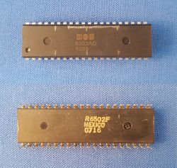
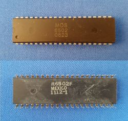
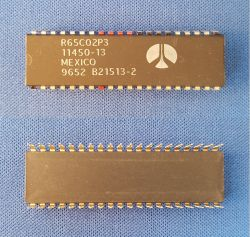
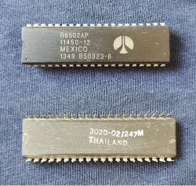
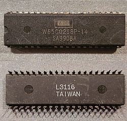
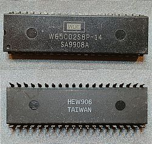

# 0. Introduction

Trying to build a 6502 based computer

I took up the challenge of building my own computer.  I grew up with the [Commodore 64](https://en.wikipedia.org/wiki/Commodore_64). It has a [6502](https://en.wikipedia.org/wiki/MOS_Technology_6502) processor. This processor was also used by Apple, Atari, Nintendo. It is simple, still available, and many hobbyist before me [documented](http://6502.org/) their projects. So 6502 it was.

The contents of this chapter

- [0.1. Which variant](#01-Which-variant) - Which 6502
- [0.2. Slow clock](#02-Slow-clock) - Notes from the datasheet
- [0.3. Documents](#03-Documents) - Technical references

## 0.1. Which variant

I started by ordering hardware. I already had breadboards, jumper wires, resistors, LEDs. The main (first) purchase was the 6502 itself. The [first](https://www.aliexpress.com/item/32929325067.html) variant (left) I got was an original one from MOS from 1985 (I think, you never know with AliExpress). I had problems resetting it (on power up it runs, but after a reset if freezes - is it broken?).
A [variant](https://www.aliexpress.com/item/32841499879.html) (right) seems to also be an old one again, although the logo and time stamp look different from the first. It does work, but it gets warm.

 

Then I [learned](http://wilsonminesco.com/NMOS-CMOSdif/) that the old ones are NMOS, and that there are new CMOS versions. I got a [new](https://www.aliexpress.com/item/32990938828.html) variant from Rockwell (left), which works well. So I bought another Rockwell (right) but this time I got R6502, not an R65C02. It works, but you can't [slow clock](#03-Slow-clock) it.

 

The latest greatest seem to be the ones from The Western Design Center (WDC). 
But they are a bit hard to source. I stumbled on these at [aliexpress](https://www.aliexpress.com/item/4000730770178.html).
I ordered a batch of five, and there where at least three types in the batch.
Here are photos of two of them. Still have to check these.

 

## 0.2. Slow clock

One of the advantages of the CMOS version is that the clock can be really slow. I like that for a development system, because it makes it easy to debug hardware. But it also allows for hardware-based single stepping.

This is what the respective datasheets have to say about it.

MOS **6502** datasheet says "Clock cycle time is minimal 1000ns" or 1us, or you operate the device out of spec. So the old NMOS is not very forgiving.

Rockwell **R65C02** datasheet says "Caution must be exercised when configuring the R65C02 in the standby mode (i.e. PHI0 clock stopped). The input clock can be held in the high state indefinitely; however, if the input clock is held in the low state longer than 5 microseconds, internal register and data status can be lost." I tried it, and my chip allowed me about 25 seconds low, but then still, it would loose state.

Western Design Center still makes 6502s (in CMOS). Their **W65C02** datasheet says "Phase 2 In (PHI2) is the system clock input to the microprocessor internal clock. During the low power Standby Mode, PHI2 can be held in either high or low state to preserve the contents of internal registers since the microprocessor is a fully static design." So the modern CMOS version is most flexible. Didn't buy one yet.

## 0.3. Documents

Datasheets on the 6502 variants

- MOS [6502 datasheet](https://www.mdawson.net/vic20chrome/cpu/mos_6500_mpu_preliminary_may_1976.pdf).
- Rockwell [R65C02 datasheet](https://www.usbid.com/assets/datasheets/15/rockwell.pdf).
- Western Design Center [W65C02 datasheet](https://www.mouser.com/datasheet/2/436/w65c02s-2572.pdf).

Detailed technical

- Synertek [hardware manual](http://archive.6502.org/datasheets/synertek_hardware_manual.pdf)
- Synertek [programming manual](http://archive.6502.org/datasheets/synertek_programming_manual.pdf)
- A [comparison](https://en.m.wikipedia.org/wiki/WDC_65C02) between the NMOS 6502 and the CMOS 6502.

(end of doc)
