# 1. Clock
Trying to build a 6502 based computer. 

We need a clock, a source of pulses. There are several options. 
Remember that a classical 6502 runs at 1MHz. 
It seems that not much variation is allowed in the clock frequency for the old variants.
It seems that the new variants allow much more variation. 
Anyhow, I don't need speed (that only causes all kinds of electrical problems).
I prefer slow, as in hand clocked, to see in detail what is going on.

The hardest way is to [build](https://www.grappendorf.net/projects/6502-home-computer/clock-generation.html) your own oscillator 
based on a [crystal](https://www.aliexpress.com/item/32869213435.html). Tried. Works. Do not recommend.

Much easier is to get a "[can](https://www.aliexpress.com/item/32887401548.html)" that presumably contains the crystal
and the passives around it. The 1MHz versions are a bit hard to get. Works well. Do recommend.

The third way is more the software approach: use an Arduino Nano to generate the clock. This is especially nice at the start 
of your project. You might already have it laying around. You do not need to order any other special components, and it gives 
you a nice road to other experiments: let the Nano spy on the address bus, or even spoof the databus!

> **Terminology**
> An oscillator is a circuit whose output oscilates. Oscillators have three pins VCC, GND, OUT.
> The circuit is usually a feedback loop around a "frequency determining element" or resonator. 
> This element can be a (quartz) crystal, which is accurate and relatively temperature independent.
> The resonator can also be a ceramic elements rather than quartz; cheaper but less stable.
> Resonators have two wires.

## 1.1. Clock - crystal
We can build our own oscillator using a crystal.

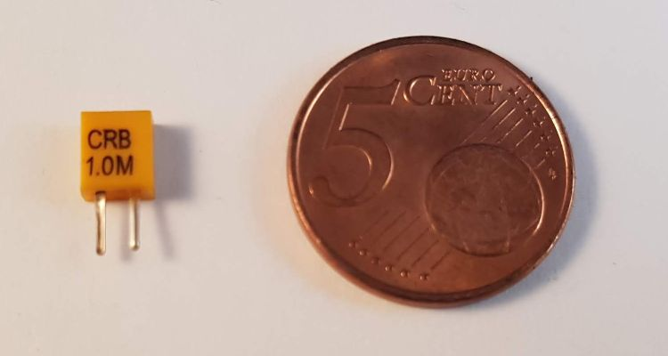

We also need two inverters, two resistors and a capacitor. 
A third inverter is the buffer amplifier for the output signal, the 1MHz clock.
For the inverters we take the 7404 IC  ("hex inverters").
This is the complete schematics

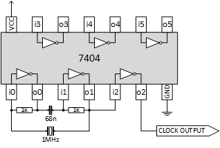

My resulting board

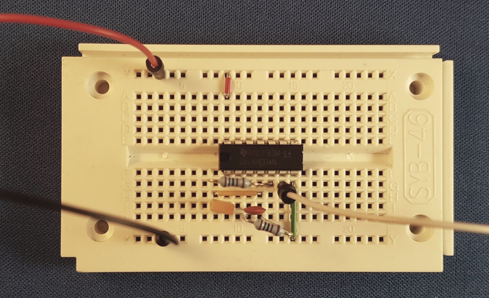

If we put the scope on the clock output, we get a 1MHz pulse (1 period is 2 divisions or 500 ns).

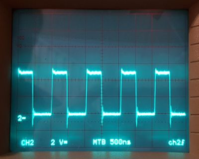

Note that especially the falling edges have overshoot. Adding a small cap would help.
In some cases, my oscillator locks in on 2.6MHz instead of 1 MHz. I do not know why.

Anyhow, this circuit can be bought as one component, a canned oscillator. 

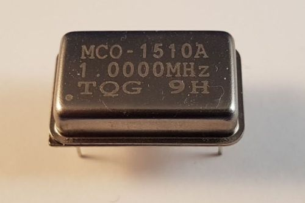

In the next section we use such a can.


## 1.2. Clock - oscillator
Our first 6502 board will have a canned oscilator. 
How to wire it? We need to
 - ensure that all input pins are connected
 - hook up the clock circuit
 - hook up a reset circuit
 - ensure we can check that the 6502 is running

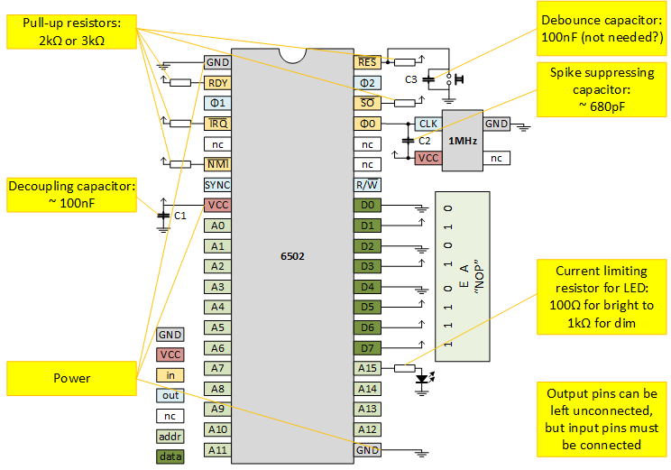

### 1.2.1. Clock - oscillator - connect all inputs
[This](http://lateblt.tripod.com/bit63.txt) was one of my sources for how to hook up pins.

Of course we hook up GND (twice) and VCC. It seems wise to add some caps, close to the 6502, between GND and VCC. 
I have a single 100nF (C1).

All input pins (I made them yellow) need to be connected.
All signal pins (RDY, IRQ, NMI, RES, SO) are low-active, so I hooked them via a pullup to VCC. My pull-ups are 2k2Ω.
The ϕ0 is the clock-input, we hook it to the oscillator (see below).
The RES not only has a pull-up, it is also hooked to the reset circuit (see below).

> Sorry if I mix up ϕ and φ.
> I type these unicode characters in my text editor, but they come out swapped in my web browser...

A special category of input pins are the data pins.
I have wired them 1110 1010 or EA, which is the opcode for NOP.
This means that the 6502 will always read NOP and will thus free run (spin around).
See also [James Calvert](http://mysite.du.edu/~jcalvert/tech/6504.htm).

There is one subtlety: also the reset vector (hardwired to FFFC and FFFD) will be read as EAEA.
But once the 6502 jumps to that address, it reads NOPs.

The NC pins and address pins are not connected.

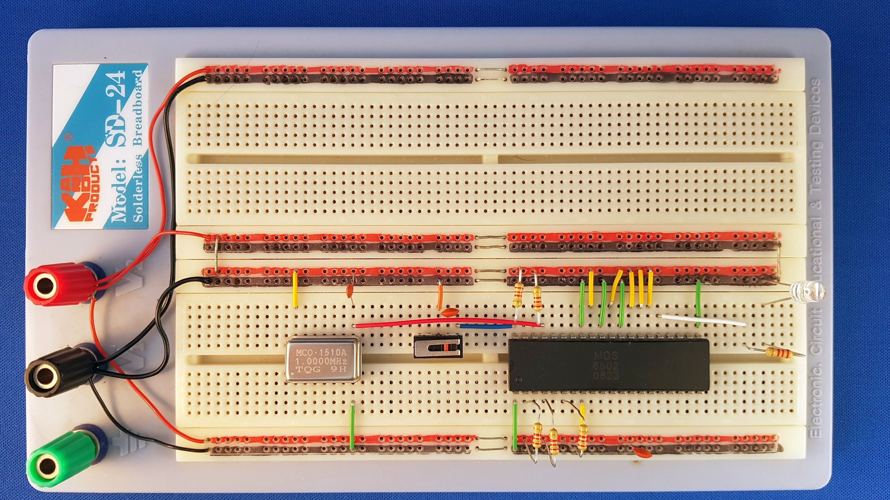

### 1.2.2. Clock - oscillator - clock circuit
As a clock circuit, we have a canned oscillator, an [MCO-1510A](http://mklec.com/pdf/MCO-1510A.pdf).
Pin 1 is NC (not connected).
Pin 7 (yes, not 2) is grounded.
Pin 8 is the OUTPUT; the clock towards the 6502.
Pin 14 is VCC.

Once VCC and GND are connected, you can put a scope on OUTPUT.

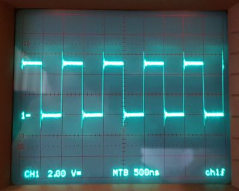

Vertically, we have 2.5 divisions of each 2V, so a swing of 5V.
Horizontally, we have two divisions per pulse so 1000ns or 1us or 1Mhz.
Looks good.

We also see overshoots at the rising edges.
Although we are running only at 1MHz, it is wise to dampen them.
That's why we added capacitor C2. You need a small one, like 680p,
or even smaller, the corners of the pulses are now quite round.


### 1.2.3. Clock - oscillator - reset circuit
We keep it simple. A push button pulls RES to ground.
We added a cap to supress (bounce) spikes and have a slow release.

In case you are wondering C=100nF, R=2k2Ω, so the rise time 𝜏 = R×C = 100n×2k2 = 220us.
Indeed, on the scope we see that in one division (200us) the signal is at 63% (1𝜏).

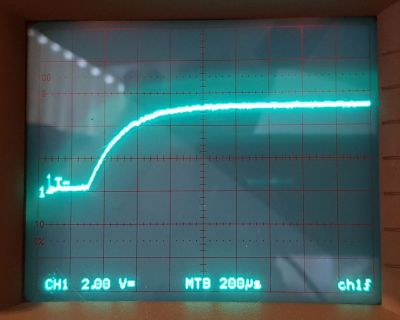

Some hook up an NE555 to reset-after-power-on, 
see e.g. [Grappendorf](https://www.grappendorf.net/projects/6502-home-computer/reset-circuit.html).

### 1.2.4. Clock - oscillator - running
The most easy way to see that the 6502 is running, is to monitor its address lines.
Note that NOP is a one byte instruction (size-wise), but that it takes 2 cycles (time-wise).

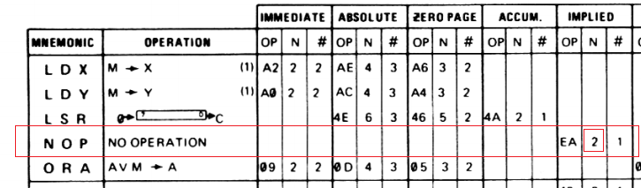

At some moment in time, the address (just picking one) 0x8000 is read. 
Let's call the tick at that moment tick 0. 
The 6502 finds a NOP. Executing that NOP takes tick 0 and 1.
On clock tick 2 address 0x8001 is read, and the 6502 finds again a NOP.
Executing the second NOP takes tick 2 and 3.
And so on.

  |  tick  | address | instruction |  A0  |
  |:------:|:-------:|:-----------:|:----:|
  |    0   | 0x8000  |  NOP (1st)  |   0  |
  |    1   | 0x8000  |  NOP (1st)  |   0  |
  |    2   | 0x8001  |  NOP (2nd)  |   1  |
  |    3   | 0x8001  |  NOP (2nd)  |   1  |
  |    4   | 0x8002  |  NOP (3rd)  |   0  |
  |    5   | 0x8002  |  NOP (3rd)  |   0  |

What we see from the tabel above is that two full periods of the clock (tick 0 and 1), A0 is low.
And then the next two clock periods (tick 2 and 3) A0 is high.
So it takes 4 clock periods for one A0 period.

This is confirmed on the scope, the top shows A0, the botton the clock

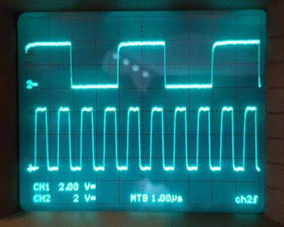

Note that the clock runs at 1MHz.
The following table shows the frequencies and periods of each address lines.

  |  line  | freq (Hz) | period (us) | period (s) |
  |:-------|----------:|------------:|-----------:|
  | clock  | 1 000 000 |           1 |            |
  |        |   500 000 |           2 |            |
  | A0     |   250 000 |           4 |            |
  | A1     |   125 000 |           8 |            |
  | A2     |    62 500 |          16 |            |
  | A3     |    31 250 |          32 |            |
  | A4     |    15 625 |          64 |            |
  | A5     |     7 813 |         128 |            |
  | A6     |     3 906 |         256 |            |
  | A7     |     1 953 |         512 |            |
  | A8     |       977 |       1 024 |            |
  | A9     |       488 |       2 048 |            |
  | A10    |       244 |       4 096 |       0.00 |
  | A11    |       122 |       8 192 |       0.01 |
  | A12    |        61 |      16 384 |       0.02 |
  | A13    |        31 |      32 768 |       0.03 |
  | A14    |        15 |      65 536 |       0.07 |
  | A15    |         8 |     131 072 |       0.13 |

A15 is pretty fast with its 8Hz, so we fixed a LED to this last address line.
LEDs on "lower" address lines would flicker so fast that they would look "always on".

Note that A15 start flickering immediately after power on. 
When we keep the reset button pressed, it stops flickering.
When releaseing the reset, the flickering starts.
Success, we have a 6502 in "free run"!


## 1.3. Clock - Nano
Our second board will have an Arduino Nano as clock generator.
Basically, we replace the MCO-1510A canned oscillator with a [Nano](https://store.arduino.cc/arduino-nano).
Of course you can also get a [clone](https://www.aliexpress.com/item/32969876875.html).

### 1.3.1. Clock - Nano - wiring
It is not much different from the previous board, but it offers much more flexibility.
One nice feature is that you can power the 6502 from the Nano (connect 5V0 to VCC, and of course connect all GNDs).
This feature is a bit hidden in the schematic below:


We need the same "stubs": RDY, nIRQ, nNMI, nRES, SO are pulled-up. 
Have a button to pull-down nRES.
Wire data lines D0-D7 to 1110 1010 representing NOP.
New is that ϕ0 is connected to D2 of the Nano.
Since the Nano will be slower than the oscillator it is good to have LEDs on lower address lines (e.g. A1, A5, A10) too.

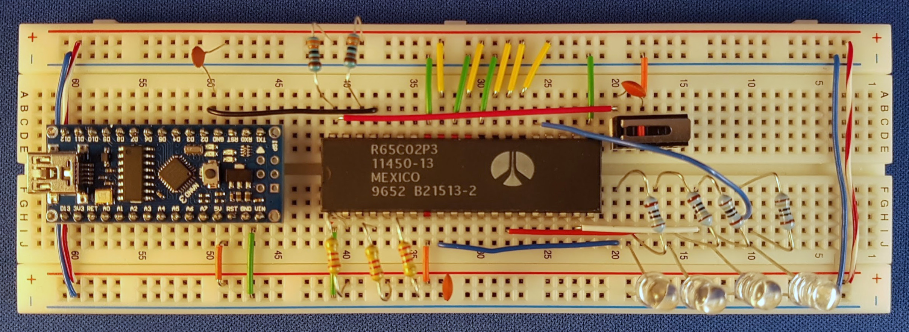


### 1.3.2. Clock - Nano - software
Find the sketch for the Nano in directory [clock6502](clock6502).
It is a simple sketch that just flips the clock line:

```cpp
void loop() {
  digitalWrite(CLOCK, HIGH);
  digitalWrite(CLOCK, LOW);
}
```

We will see later that this generates a clock of ~160kHz.

We could speed this up by using direct SFR manipulation of the Nano, see for example this 
[video](https://www.youtube.com/watch?v=U7I0GkwW1yE) of Julian Ilett.
However, we are going to add so much code later on, that it doesn't help.


### 1.3.3. Clock - Nano - running
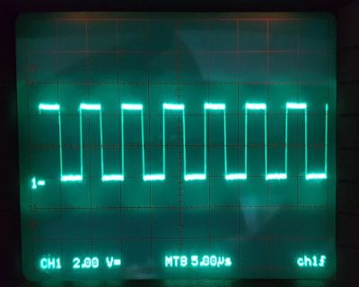

The scope confirms the slow clock: 7 divisions (35us) is 5 periods, so one period is 7us.
The clock frequency is thus 143kHz, let me be so bold to treat it as 160kHz.

Note that the Nano itself runs on 16MHz. This means that the `loop()` takes roughly 100 (16M/160k) Nano clock cycles to 
generate one 6502 clock cycle. So, a single `digitalWrite()` takes roughly 50 cycles.

### 1.3.4. Clock - Nano - software II
Find a second sketch for the Nano in directory [clockvar6502](clockvar6502).
This sketch allows you to enter + or - in the Serial port (the arduino terminal requires a press on the ENTER key as well).
This will shorten or lengthen the high part of the clock pulse.

In my first version, the program generated this timed pulse
```
go low, wait*0.5, go high, wait*0.5
```
but I changed this to
```
go low, wait*0.0, go high, wait*1.0
```
because the 6502 stops working when the low time is too long.

With the current program the Nano can vary the clock from 100kHz to 0.06Hz:

```
Welcome to clockvar6502
press + or - to speed up or slow down
10+4096us, 243.55Hz
10+2048us, 485.91Hz
10+1024us, 967.12Hz
10+512us, 1915.71Hz
10+256us, 3759.40Hz
10+128us, 7246.38Hz
10+64us, 13513.51Hz
10+32us, 23809.52Hz
10+16us, 38461.54Hz
10+8us, 55555.55Hz
10+4us, 71428.57Hz
10+2us, 83333.34Hz
10+1us, 90909.10Hz
10+2us, 83333.34Hz
10+4us, 71428.57Hz
10+8us, 55555.55Hz
10+16us, 38461.54Hz
10+32us, 23809.52Hz
10+64us, 13513.51Hz
10+128us, 7246.38Hz
10+256us, 3759.40Hz
10+512us, 1915.71Hz
10+1024us, 967.12Hz
10+2048us, 485.91Hz
10+4096us, 243.55Hz
10+8192us, 121.92Hz
10+16384us, 61.00Hz
10+32768us, 30.51Hz
10+65536us, 15.26Hz
10+131072us, 7.63Hz
10+262144us, 3.81Hz
10+524288us, 1.91Hz
10+1048576us, 0.95Hz
10+2097152us, 0.48Hz
10+4194304us, 0.24Hz
10+8388608us, 0.12Hz
10+16777216us, 0.06Hz
10+16777216us, 0.06Hz
10+16777216us, 0.06Hz
10+16777216us, 0.06Hz
```

I especially like the 0.06Hz: 16 seconds per clock is really nice slow stepping.
Would it be possible to single step with button presses?

The above test was done with 650 variant 2 (Rockwell). 
Variant 1 (original MOS) still works at 7.63hz, but stops at 3.81Hz.
Variant 3 (new MOS?) still wokrs at 0.48Hz, but stops at 0.24Hz or 0.12Hz.


