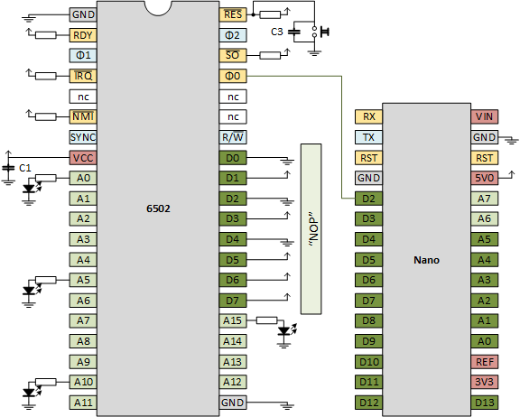
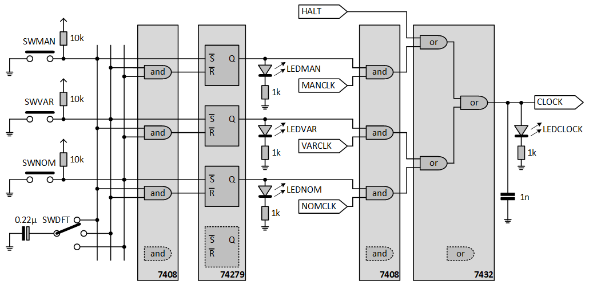

# 1. Clock

Trying to build a 6502 based computer.

We need a clock, a source of pulses. There are several options. Remember that a classical 6502 runs at 1MHz. It seems that not much variation is allowed in the clock frequency for the old variants. It seems that the new variants allow much more variation. Anyhow, I don't need speed; that only causes all kinds of electrical problems. I prefer slow, as in hand clocked, to see in detail what is going on.

The hardest way is to [build](https://www.grappendorf.net/projects/6502-home-computer/clock-generation.html) your own oscillator based on a [crystal](https://www.aliexpress.com/item/32869213435.html). Tried. Works. Do not recommend.

Much easier is to get a "[can](https://www.aliexpress.com/item/32887401548.html)" that presumably contains the crystal and the passives around it. The 1MHz versions are a bit hard to get. Works well. Easy. Stable. Do recommend.

The third way is more the software approach: use an Arduino Nano to generate the clock. This is especially nice at the start of your project. You might already have it laying around. You do not need to order any other special components, and it gives you a nice road to other experiments: let the Nano spy on the address bus, or even spoof the data bus!

The next experiments are aimed at getting a slows clock: single stepping with a switch or slow but automatic stepping with an NE555.

We will do the following experiments

- [1.1. Clock - crystal](#11-Clock---crystal) - Using a crystal for clocking
- [1.2. Clock - oscillator](#12-Clock---oscillator) - Using a canned oscillator for clocking
- [1.3. Clock - Nano](#13-Clock---Nano) - Using an Arduino Nano for clocking
- [1.4. Clock - micro switch](#14-Clock---micro-switch) - Using a micro switch for manual clocking
- [1.5. Clock - NE555](#15-Clock---NE555) - Using an NE555 for clocking
- [1.6. Triple clock module](#16-Triple-clock-module) - A standard clock module

## 1.1. Clock - crystal

> **Terminology**  
> An _oscillator_ is a circuit whose output oscillates. This output signal is used as a _clock_ for some circuit. Oscillators have three pins VCC, GND, OUT. The circuit is usually a feedback loop around a "frequency determining element" or _resonator_. The resonator can be a (quartz) crystal, which is accurate and relatively temperature independent. The resonator can also be a ceramic element rather than quartz; cheaper but less stable. Resonators have two wires.

We can build our own oscillator using a crystal as resonator.


We also need two inverters, two resistors and a capacitor. A third inverter is the buffer amplifier for the output signal, the 1MHz clock. For the inverters we take the 7404 IC  ("hex inverters"). This is the complete schematics


My resulting board


If we put the scope on the clock output, we get a 1MHz pulse (1 period is 2 divisions of 500 ns).


Note that especially the falling edges have overshoot. Adding a small capacitor will help (see [1.2.2.](#122-Clock---oscillator---clock-circuit) for an example). In some cases, my oscillator locks in on 2.6MHz instead of 1 MHz. I do not know why.

Anyhow, this circuit can be bought as one component, a canned oscillator.


In the next section we use such a can to supply clock ticks to the 6502.

## 1.2. Clock - oscillator

Our first 6502 board will have a canned oscillator.  How to wire a 6502? We need to

- ensure that all 6502 input pins are connected
- hook up the oscillator
- hook up a reset circuit
- ensure we can check that the 6502 is running

Find below the schematic used in this section. The subsection will discuss the details.


### 1.2.1. Clock - oscillator - connect all inputs

[This](http://lateblt.tripod.com/bit63.txt) was one of my sources for how to hook up pins.

Of course we hook up GND (twice!) and VCC. It seems wise to add some caps, close to the 6502, between GND and VCC. I have a single 100nF (C1).

All input pins (I made them yellow in the schematic above) need to be connected (a common advise for chips). All signal pins (RDY, nIRQ, nNMI, nRES, nSO) are low-active (RDY is edge sensitive), so I hooked them via a pull-up to VCC. My pull-ups are 2k2Ω. The ϕ0 is the clock-input, we hook it to the oscillator (see [1.2.2.](#122-Clock---oscillator---clock-circuit)). The nRES not only has a pull-up, it is also hooked to the reset circuit (see below).

> Sorry if I mix up ϕ and φ. I type these unicode characters in my text editor, but they come out swapped in my web browser... [ex1](unicode-chrome-windows-edit.png) [ex2](unicode-chrome-windows-view.png) [ex3](unicode-vscode-with-preview.png)

A special category of input pins are the _data_ pins (D0..D7). I have wired them 1110 1010 or EA, which is the opcode for NOP. This means that the 6502 will always read NOP and will thus free run (spin around). See also [James Calvert](http://mysite.du.edu/~jcalvert/tech/6504.htm).

There is one subtlety: also the reset vector (hardwired to FFFC and FFFD) will be read as EAEA. But once the 6502 jumps to that address, it reads NOPs.

The NC pins and address pins (A0..A15) are not connected.

That results in a relatively empty breadboard.


### 1.2.2. Clock - oscillator - clock circuit

As a clock circuit, we have a canned oscillator, an [MCO-1510A](http://mklec.com/pdf/MCO-1510A.pdf). Pin 1 is NC (not connected). Pin 7 (yes, not 2) is grounded. Pin 8 is the OUTPUT; the clock towards the 6502. Pin 14 is VCC.

Once VCC and GND are connected, the OUTPUT shows a square wave. Here is the scope capture.


Vertically, we have 2.5 divisions of each 2V, so a swing of 5V. Horizontally, we have two divisions per pulse so 1000ns or 1us or 1MHz. Looks good.

We also see overshoots at both the rising and falling edges. Although we are running only at 1MHz, it is wise to dampen them. That's why we added capacitor C2. You need a small one, like 680p, or even smaller, the corners of the pulses are now less spikey.


### 1.2.3. Clock - oscillator - reset circuit

We keep the reset circuit simple. A push button pulls (low active) nRES to ground. We added a cap to suppress (bounce) spikes and have a slow release.

In case you are wondering C=100nF, R=2k2Ω, so the rise time 𝜏 = R×C = 100n×2k2 = 220us. Indeed, on the scope we see that in one division (200us) the signal is at 63% (1𝜏).


Some hook up an NE555 to reset-after-power-on, see e.g. [Grappendorf](https://www.grappendorf.net/projects/6502-home-computer/reset-circuit.html).

### 1.2.4. Clock - oscillator - running

The most easy way to see that the 6502 is running, is to monitor its address lines. Note that NOP is a one byte instruction (size-wise), but that it takes 2 cycles (time-wise).


At some moment in time, the address (just picking one) 0x8000 is read. Let's call the tick at that moment tick 0. The 6502 finds a NOP. Executing that NOP takes tick 0 and 1. On clock tick 2 address 0x8001 is read, and the 6502 finds again a NOP. Executing the second NOP takes tick 2 and 3. And so on.

|  tick  | address | instruction |  A0  |
|:------:|:-------:|:-----------:|:----:|
|    0   | 0x8000  |  NOP (1st)  |   0  |
|    1   | 0x8000  |  NOP (1st)  |   0  |
|    2   | 0x8001  |  NOP (2nd)  |   1  |
|    3   | 0x8001  |  NOP (2nd)  |   1  |
|    4   | 0x8002  |  NOP (3rd)  |   0  |
|    5   | 0x8002  |  NOP (3rd)  |   0  |

What we see from the table above is that two full periods of the clock (tick 0 and 1), A0 is low. And then the next two clock periods (tick 2 and 3) A0 is high. So it takes 4 clock periods for one A0 period.

This is confirmed on the scope, the top shows A0, the bottom the clock.


Note that the clock runs at 1MHz. The following table shows the frequencies and periods of each address line.

|  line  | freq (Hz) | period (us) | period (s) |
|:-------|----------:|------------:|-----------:|
| clock  | 1 000 000 |           1 |            |
|        |   500 000 |           2 |            |
| A0     |   250 000 |           4 |            |
| A1     |   125 000 |           8 |            |
| A2     |    62 500 |          16 |            |
| A3     |    31 250 |          32 |            |
| A4     |    15 625 |          64 |            |
| A5     |     7 813 |         128 |            |
| A6     |     3 906 |         256 |            |
| A7     |     1 953 |         512 |            |
| A8     |       977 |       1 024 |            |
| A9     |       488 |       2 048 |            |
| A10    |       244 |       4 096 |       0.00 |
| A11    |       122 |       8 192 |       0.01 |
| A12    |        61 |      16 384 |       0.02 |
| A13    |        31 |      32 768 |       0.03 |
| A14    |        15 |      65 536 |       0.07 |
| A15    |         8 |     131 072 |       0.13 |

A15 is still pretty fast with its 8Hz, but visible to the human eye. I fixed a LED to this last address line. LEDs on "lower" address lines flicker so fast that they would appear "always on".

Note that A15 start flickering immediately after power on. When we keep the reset button pressed, it stops flickering. When releasing the reset, the flickering starts again. Success, we have a 6502 in "free run"!

## 1.3. Clock - Nano

Our second board will have an Arduino Nano as clock generator. Basically, we replace the MCO-1510A canned oscillator with a [Nano](https://store.arduino.cc/arduino-nano). Of course you can also get a [clone](https://www.aliexpress.com/item/32969876875.html).

### 1.3.1. Clock - Nano - wiring

The wiring on the second board is not much different from the previous board, but it offers much more flexibility. One nice feature is that you can power the 6502 from the Nano (connect 5V0 to VCC, and of course connect all GNDs). This feature is a bit hidden in the schematic below.



It might be wise to add a capacitor between the clock and VCC, just as we had with the canned oscillator.

We need the same "stubs": RDY, nIRQ, nNMI, nRES, nSO are pulled-up. Have a button to pull-down nRES. Wire data lines D0-D7 to 1110 1010 (0xEA) representing NOP. New is that ϕ0 is connected to D2 of the Nano. Since the Nano will be slower than the oscillator it is good to have LEDs on lower address lines (e.g. A1, A5, A10) too.


### 1.3.2. Clock - Nano - software

Find the sketch for the Nano in directory [clock6502](clock6502).
It is a simple sketch that just flips the clock line:

```cpp
void loop() {
  digitalWrite(CLOCK, HIGH);
  digitalWrite(CLOCK, LOW);
}
```

We will see later that this generates a clock of ~160kHz.

We could speed this up by using direct SFR manipulation of the Nano, see for example this [video](https://www.youtube.com/watch?v=U7I0GkwW1yE) of Julian Ilett. However, we are going to add so much code later on, that it doesn't help.

### 1.3.3. Clock - Nano - running

The scope confirms the slow clock: 7 divisions (35us) is 5 periods, so one period is 7us. The clock frequency is thus 143kHz, let us "round that up" to 160kHz.


Note that the Nano itself runs on 16MHz. This means that the `loop()` takes roughly 100 (16M/160k) Nano clock cycles to generate one 6502 clock cycle. So, a single `digitalWrite()` takes roughly 50 cycles.

### 1.3.4. Clock - Nano - software II

Find a second sketch for the Nano in directory [clockvar6502](clockvar6502).
This sketch allows you to enter + or - in the Serial port (the arduino terminal requires a press on the ENTER key as well).
This will shorten or lengthen the high part of the clock pulse.

In my first version, the program generated a 50-50 timed pulse

```cpp
  digitalWrite(CLOCK, LOW); wait(50); digitalWrite(CLOCK, HIGH); wait(50); // waits in %
```

but I changed this to a 0-100 pulse (the 0 is not completely 0 because it is still several Nano ticks)

```cpp
  digitalWrite(CLOCK, LOW); digitalWrite(CLOCK, HIGH); wait(100); // waits in %
```

because the 6502 stops working when the low time is too long.

With the current program the Nano can vary the clock from 100kHz to 0.06Hz:

```text
Welcome to clockvar6502
press + or - to speed up or slow down
10+4096us, 243.55Hz
10+2048us, 485.91Hz
10+1024us, 967.12Hz
10+512us, 1915.71Hz
10+256us, 3759.40Hz
10+128us, 7246.38Hz
10+64us, 13513.51Hz
10+32us, 23809.52Hz
10+16us, 38461.54Hz
10+8us, 55555.55Hz
10+4us, 71428.57Hz
10+2us, 83333.34Hz
10+1us, 90909.10Hz
10+2us, 83333.34Hz
10+4us, 71428.57Hz
10+8us, 55555.55Hz
10+16us, 38461.54Hz
10+32us, 23809.52Hz
10+64us, 13513.51Hz
10+128us, 7246.38Hz
10+256us, 3759.40Hz
10+512us, 1915.71Hz
10+1024us, 967.12Hz
10+2048us, 485.91Hz
10+4096us, 243.55Hz
10+8192us, 121.92Hz
10+16384us, 61.00Hz
10+32768us, 30.51Hz
10+65536us, 15.26Hz
10+131072us, 7.63Hz
10+262144us, 3.81Hz
10+524288us, 1.91Hz
10+1048576us, 0.95Hz
10+2097152us, 0.48Hz
10+4194304us, 0.24Hz
10+8388608us, 0.12Hz
10+16777216us, 0.06Hz
10+16777216us, 0.06Hz
10+16777216us, 0.06Hz
10+16777216us, 0.06Hz
```

I especially like the 0.06Hz: 16 seconds per clock is really nice slow stepping. Would it be possible to single step with button presses?

The above test was done with the R65C02 (Rockwell). The MOS 6502 still works at 7.63hz, but stops at 3.81Hz. The other MOS still works at 0.48Hz, but stops at 0.24Hz or 0.12Hz.

## 1.4. Clock - micro switch

With the low frequency reached with the Nano, I decided to also check if manual pulsing (single stepping with button presses) is possible.

As [Ben Eater](https://www.youtube.com/watch?v=81BgFhm2vz8) explains buttons have bounce, so a single press could cause multiple clock ticks. We don't want that; we need to debounce the signal. Ben uses an NE555 in mono-stable mode, I decide to use a Set/Reset latch (there are four of them in an [74279](https://www.aliexpress.com/item/32959185316.html) chip).


Note that the 74279's control signals are low active, so the double throw switch has its common to ground and the NO (normally open) and NC (normally closed) pulled-high. Also note that the normally closed is connected to the latch, so that in idle position, the output (Q) is high. The reason for this is that the 6502 does not survive long _low_ periods of the clock.

The above circuit replaces the Nano in the schematic of [1.3.1.](#131-Clock---Nano---wiring) and I have added LEDs on _all_ address pins. This is the resulting breadboard. The top-right shows the single-step micro switch circuit. The top-left shows NE555 based clocking circuit from the [next](#15-Clock---NE555) section.


## 1.5. Clock - NE555

Slow clocking is nice because we can see what is going on in detail, but pressing a button for every tick is tiresome. So, I created a square wave generator based on an NE555 (a so-called a-stable configuration). This is a copy of [Ben's](https://www.youtube.com/watch?v=kRlSFm519Bo) NE555 clock.


By varying the resistor value, the frequency can be adapted. I will opt for an R_A of 1kΩ, and an R_B composed of a fixed R_B1 of 1kΩ and a potentiometer R_B2 of 1MΩ. Together with a capacitor of 2.2µF, this leads to a frequency range of 0.3Hz to over 200Hz (see the yellow note with computations in the above figure).

This NE555 circuit was added to the breadboard of [1.4.](#14-Clock---micro-switch) There is a double throw switch to select between the micro switch and the NE555 source. See the [video](https://www.youtube.com/watch?v=JenGqVLovyA), which demonstrates a reset (single stepping), and than switching to the NE555 clock.

> How to dimension the components?
>
> Let's start by looking at the "fast" case, the potentiometer R_B2 to 0Ω.
> The first observation is that there is probably a minimum value for R_A, 
> otherwise the current through the discharge transistor gets too large.
> I could not find this spec point in the NE555 datasheet, but 
> [note 3 in this book](https://books.google.nl/books?id=N6FDii6_nSEC&pg=PA285) 
> suggests 1kΩ as minimum. Let's set **R_A to 1kΩ**.
>
> Is there a lower limit for R_B1? I don't know if there is a similar current limiting argument as for R_A, 
> but there is a functional one. If R_B1 gets smaller, the duty cycle t_H/t gets towards 100%. 
> If we want it towards 50%, then R_B1 needs to be (much) greater then R_A.
> I decided to settle for same value as R_A, so also **1kΩ for R_B1**.
> This gives a duty cycle of 66% high and 33% low for the fast case, the short low is still long enough.
>
> We have now fixed R_A and R_B1. 
> To determine R_B2 and C, let's consider the "slow" case, the potentiometer R_B2 to max.
>
> To get the biggest dynamic range (the ratio of the generated clock frequencies for pot to min respectively max),
> the potmeter needs to have the highest value. The biggest I could find was **1MΩ for R_B2**
> Note that _t_max_/_t_min_ = 0.693(R_A+2×(R_B1+R_B2))×C / 0.693(R_A+2×R_B1)×C = (R_A+2×(R_B1+R_B2)) / (R_A+2×R_B1).
> Since we have R_A=R_B1, we can simplify the ratio to (3×R_B1+2×R_B2) / (3×R_B1).
> Under the assumption that R_B1<<R_B2, we can simplify the ratio to 2×R_B2 / 3×R_B1 = 0.66 R_B2/R_B1.
> So with R_B2=1M and R_B1=1k, we get a dynamic range of 666.
>
> With the capacitor C, we "place" the range. 
> We could for example have a _t_min_ of 1ms (f=1000Hz) and a _t_max_ of 666ms (1.5Hz)
> Or we can for example have a _t_min_ of 10ms (f=100Hz) and a _t_max_ of 6666ms (0.15Hz)
> The former needs a C of 0.47µF and the latter one of 4.7µF.
> I like slow, but 6.5 seconds per tick is a bit overdone. 
> So I settled on **C of 2.2µF**, this gives a range of 4.6ms..3s (220Hz..0.33Hz).

## 1.6. Triple clock module

For my "end-product", I would like a 6502 computer with three clocks: _manual_ (the micro switch single-step per press), _variable_ (the NE555 with the potentiometer that regulates the frequency), and _nominal_ (the canned 1MHz oscillator).

We need a selector with three states (manual, variable, nominal), but the transitions need to be debounced. I decide to take a quad SR latch (74279). Three latches are used in the selector: one for each switch (SWMAN, SWVAR, SWNOM) - the fourth latch is used for the [hand micro switch](#14-Clock---micro-switch). Only one latch at a time will be "set", indicating which of the three clock sources is selected. The output of the latches is routed to three LEDs (LEDMAN, LEDVAR, LEDNOM) to give feedback on the state of the selector. The selection part of the circuit is on the left hand side of below schematics. One final detail, the triple throw switch (SWDFT) selects which state is selected on power-up.



As said, of the three output lines (the Qs from the latches), only one is set at a time. This means that only one of the clock sources (MANCLK, VARCLK, NOMCLK) is passed on by the three ANDs. Finally, the ORs send out a single CLOCK signal. I have attached a LEDCLOCK for monitoring, and a capacitor to suppress spikes.

By the way, MANCLK is the output of the circuit in section [1.4](#14-Clock---micro-switch), the VARCLKis the output of the circuit in section [1.5](#15-Clock---NE555), and NOMCLK is the output of the canned oscillator, see section [1.2](#12-Clock---oscillator). One final detail, the HALT signal (when high) disables CLOCK (again, in the high state, because otherwise the 6502 looses state). The idea is that a program, via a simple IO device can raise the HALT line and with that stop itself.

Here is a prototype of my complete clock module.


(end of doc)
