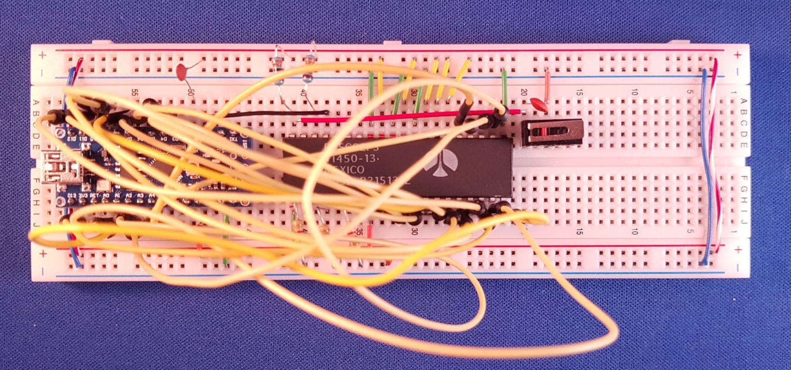

# Emulation
Trying to build a 6502 based computer.

We have (see [previous chapter](..\1clock)) a 6502 in free run: it executes NOP, NOP, NOP, ... and by inspecting
the address lines (either having LEDs on the high lines, or using the scope on the low lines) we observe the addresses change.

But are we sure the 6502 is doing what we expect? Is it really starting at address EAEA (the reset vector at FFFC and FFFD also 
reads EA and EA) and then progressing to EAEB, EAEC? Would be nice if we can check that. 

Then I had a nice idea: the Nano controls the clock, so it knows when the address bus is valid, can't the Nano snoop it?
Can't we snoop (read) the data bus as well? Can't we _write_ the data bus? Yes, yes, and yes.

## 1 Clock

The [first step](https://github.com/maarten-pennings/6502/tree/master/1clock#clock---nano---wiring) was taken in the 
previous chapter. We used a Nano as a clock source for the 6502. The address lines are dangling, the data lines are hardwired to EA 
(the opcode of the NOP instruction). We had a very simple sketch that flips the clock line, and behold we had a 6502 
"free" running at 160kHz.

## 2 Address bus

With the first experiment, we believe the 6502 is executing NOPs. Can we check that? Can we check that it starts at EAEA 
(the reset vector at FFFC and FFFD also reads EA and EA) and then progressing to EAEB, EAEC? Can we spy the address bus?

Since the Nano generates the clock, we know when we have to sample the address bus.
Does the Nano have enough inputs? It seems to have D0..D13 so 14 lines.
However D0 and D1 [double](https://www.theengineeringprojects.com/wp-content/uploads/2018/06/introduction-to-arduino-nano-13-1.png) 
as RXD and TXD and we need those two pins to send the trace to the PC (over USB). That leaves us with 12 lines, where 16 would be nice.
From the [pinout](https://www.theengineeringprojects.com/wp-content/uploads/2018/06/introduction-to-arduino-nano-13-1.png)
we see that analog pins A0..A5 also have a double role, they can act as digital pins. That's 6 more digital pins. 

In other words, we have 18 digital pins. We need 1 for clock and 16 far the address lines. Even one spare.


The schematics above looks like this on my breadboard:



The program on the Nano, [AddrSpy6502](addrspy6502) is simple. The `loop()` pulses the clock, 
reads all 16 address lines and prints them out in hex (with a time stamp).
```cpp
void loop() {
  // Send clock low
  digitalWrite(PIN_CLOCK, LOW);
  // Send clock high again
  digitalWrite(PIN_CLOCK, HIGH);
  
  // Read address bus
  uint16_t addr=0 ;
  addr += digitalRead(PIN_ADDR_0 ) << 0;
  addr += digitalRead(PIN_ADDR_1 ) << 1;
  ...
  addr += digitalRead(PIN_ADDR_15) << 15;

  // Print address bus
  char buf[32];
  sprintf(buf,"%9ldus %04x",micros(),addr);
  Serial.println(buf);
}
```

This is the experiment I did.
- I pressed the reset button of the Nano down, and with the same hand I pressed the reset button of the 6502 down.
- I cleared the output of the Arduino terminal
- I released the reset of the Nano.
- As soon as I saw the first output of the Nano, I released the reset of the 6502.
- I disabled autoscroll in the terminal and copied the trace.

This was the trace (I manually added the `<- reset released`)

```
Welcome to AddrSpy6502
      400us 3586
      828us 3586
     1264us 3586
     1704us 3586
     2928us 3586
     4460us 3586
     5988us 3586
     7520us 3586
        ...  
   406848us 3586
   408380us 3586
   409908us 3586 <- reset released
   411440us 3586
   412968us 01ee
   414500us 01ed
   416028us 01ec
   417556us fffc
   419088us fffd
   420620us eaea
   422148us eaeb
   423680us eaeb
   425208us eaec
   426740us eaec
   428268us eaed
   429800us eaed
   431328us eaee
   432860us eaee
   434388us eaef
   435916us eaef
   437448us eaf0
   438980us eaf0
   440508us eaf1

```

Note that the first ~400 000 us of the Nano trace, the 6502 was still in reset.
It had a random pattern on the address bus, in this case 3586 (hex).
Just before 409908us I released the reset of the 6502 (you can't see that, it's my guess).

What we see on the address bus can be found in the 6502 datasheet, but is also very well explained
on the [6502.org site](http://www.6502.org/tutorials/interrupts.html#1.3):

```
                 // 6502 reset released
   409908us 3586 // first internal administrative operation of 6502
   411440us 3586 // second internal operation
   412968us 01ee // push of return address (PCH) on stack, decrement stack pointer (note S is EE)
   414500us 01ed // push the return address (PCL) on stack, decrement stack pointer (note S is ED)
   416028us 01ec // push the processor status register (P) on stack, decrement stack pointer (note S is EC)
   417556us fffc // get PCL from reset vector (FFFC), presumably reads EA
   419088us fffd // get PCH from reset vector (FFFD), presumably reads EA
   420620us eaea // Jump to reset vector, indeed EAEA. Executes first instruction (NOP)
   422148us eaeb // Executes 2nd instruction (NOP)
   423680us eaeb // Executes 2nd instruction (NOP)
   425208us eaec // Executes 3rd instruction (NOP)
   426740us eaec // Executes 3rd instruction (NOP)
```

Some notes
 - All three interrupts, NMI with vector at FFFA, RESET with vector at FFFC and IRQ with vector at FFFE
   have the same 7-clock interrupt sequence. 
 - One exception: for RESET the three pushes are fake: the 6502 issues a _read_ to the memory instead of a _write_.
 - The stack pointer (S) has a random value after reset, in the above run it happened to be EE.
   The stack page is hardwired to 01 on the 6502.
 - A NOP is two cycles, and we see that after RESET the address bus indeed changes every other step.
 - I can not explain why the first NOP only takes one clock.
 - The time between the trace lines (one clock period) is about 1500us, so we are running at 0.7kHz


## 3 Jump loop

The previous experiment is a success: we see the address lines increment nicely (in steps of two)
and also the reset behavior is as documented. Still, it would be nice to have a more realistic program;
a series of NOPs is not very convincing.

However, without a memory to store our program, we are limited in our possibilities.
There is one way out: go old style. Write a program in _hardware_.

I got the idea from [James Calvert's tight loop](http://mysite.du.edu/~jcalvert/tech/6504.htm).
We make some logic that emulates an 8 byte program.
We NOR together the first three address lines to create the "v-signal".
The v-signal is bound to D2, D3 and D6, the other data lines (D0, D1, D4, D5 and D7) are bound to GND.
So, the data bus is 0b 0v00 vv00. This means that 
 - if v=0 then D = 0b 0000 0000 = 0x00
 - if v=1 then D = 0b 0100 1100 = 0x4C

For the various addresses, that gives the following data reads:

  | address (hex) | address (bin) | v-signal| data |
  |:-------------:|:-------------:|:-------:|:----:|
  |     ...       |       ...     |         |      |
  |     FFFC      |    ... 100    |    0    |  00  | 
  |     FFFD      |    ... 101    |    0    |  00  |
  |     FFFE      |    ... 110    |    0    |  00  |
  |     FFFF      |    ... 111    |    0    |  00  |
  |     0000      |    ... 000    |    1    |  4C  |
  |     0001      |    ... 001    |    0    |  00  |
  |     0002      |    ... 010    |    0    |  00  |
  |     0003      |    ... 011    |    0    |  00  |
  |     ...       |       ...     |         |      |

In other words, at FFFC, the 6502 reads the start address 00 00, and at 0000 the 6502 reads 4C 00 00.
Note that 4C 00 00 means JMP 0000, since 4C is the opcode for JMP abs.

This the schematic


Here is a photo of my board. Note the _triple OR_ (4075) and the _hex inverter_ (7404) chips on the right.
Also note the three blue wires coming in (from A0, A1, A2) and the blue wire going out (to D2, d3 and D6).


With the same [sketch](addrspy6502) as the previous experiment, let's make a trace again.
We repeat our manual steps: Nano reset down, 6502 reset down, Nano reset up, wait for output, 6502 reset up.
This is the trace (I manually added the `<- reset released`) 

```
Welcome to AddrSpy6502
      400us 0001
      820us 0001
     1248us 0001
     1676us 0001
        ...
   263028us 0001
   264560us 0001
   266088us 0001
   267620us 0001
   269148us 0001
   270680us 0001 <- reset released
   272208us 0001
   273740us 01fa
   275268us 01f9
   276800us 01f8
   278328us fffc
   279856us fffd
   281388us 0000
   282920us 0001
   284448us 0002
   285980us 0000
   287508us 0001
   289040us 0002
   290568us 0000
   292100us 0001
   293628us 0002
```

Some notes
 - Before 270680us the reset is released (can't see that from the trace). 
 - We see the two internal administrative operations
 - We see the (fake) push of PCH, PCL, P.
   The stack pointer S now starts at FA, so pushes to 01FA, 01F9 and 01F8.
 - We see the reset vector load (FFFC, FFFD)
 - We see the load of 0000 (this confirms that FFFC and FFFD read 00 00)
 - We see the load of 0001, 0002
 - We see the load of 0000 again, which hints that JMP 0000 was executed
 - One clock is still about 1500us (0.7kHz)


## 4 Data bus

In the notes on the previous experiment, we have " load of 0000 (this confirms that FFFC and FFFD read 00 00)".
Wouldn't it be nice if we could not only see the _address_ bus, but also the _data_ bus?
We can, but we loose details on the address bus.

Recall that we have Nano D2 for the 6502 ϕ0 (clock), and Nano D4..D13 plus A0..A5 for 6502 A0..A15.
This leaves Nano D3, A6 and A7 free.
Let's redesign.

 - Leave Nano D2 to R6502 ϕ0 (clock).
 - Connect Nano D3 to R6502 R/nW so that we can trace if the 6502 did a read or a write on the data bus.
 - Use Nano D4..D11 for 6502 data bus D0..D7. Full data trace.
 - Use Nano D12, D13, A0..A7 for 6502 A0..A9. Thus 10 bit address trace.


Find below my breadboard version. I still have the JMP loop circuit (3-input OR with inverter) on the right.


There is one problem with this wiring: Nano A6 and A7 are analog only.
We cannot use `digitalRead()` on those pins.
We can however read them in an analog fashion by using `analogRead()` and comparing the result with half the 
maximum analog readout: 1024/2.
The drawback is that `analogRead()` is [slow](https://www.arduino.cc/reference/en/language/functions/analog-io/analogread/):

> On ATmega based boards (UNO, Nano, Mini, Mega), it takes about 100 microseconds (0.0001 s) 
> to read an analog input, so the maximum reading rate is about 10,000 times a second.

We prefer to use 10 bits, because this means we have 4 pages (a 6502 page is 256 bytes):
 - page 0, for well, zero-page addressing of the 6502
 - page 1, for the stack (hardwired on page 1 by the 6502)
 - page 2, for the code
 - page 3, for the interrupt vectors (hardwired to FFFx by the 6502)

The result is a memory map with 4 pages of each 256 bytes (so 1kB in total), that is mirrored 64 times:


The associated [Arduino sketch](addrdataspy6502), now also captures R/nW and the data pins:

```cpp
void loop() {
  // Send clock low
  digitalWrite(PIN_CLOCK, LOW);
  // Send clock high again
  digitalWrite(PIN_CLOCK, HIGH);
  
  // Read address bus
  uint16_t addr=0 ;
  addr += digitalRead(PIN_ADDR_0) << 0;
  addr += digitalRead(PIN_ADDR_1) << 1;
  ...

  // Read R/nW
  uint16_t rnw=0 ;
  rnw += digitalRead(PIN_RnW) << 0;
  
  // Read data bus
  uint16_t data=0 ;
  data += digitalRead(PIN_DATA_0) << 0;
  data += digitalRead(PIN_DATA_1) << 1;
  ...

  // Print address bus
  char buf[32];
  sprintf(buf,"%9ldus %03x %0x %02x",micros(),addr,rnw,data);
  Serial.println(buf);
}
```

The results are great. We made a trace in the same way as before

```
Welcome to AddrDataSpy6502
      752us 002 1 00
     1504us 002 1 00
     2264us 002 1 00
     3024us 002 1 00
        ...
   376984us 002 1 00
   378856us 002 1 00 <- reset
   380736us 002 1 00
   382608us 1fd 1 00
   384464us 1fc 1 00
   386336us 1fb 1 00
   388216us 3fc 1 00
   390088us 3fd 1 00
   391944us 000 1 4c
   393816us 001 1 00
   395696us 002 1 00
   397568us 000 1 4c
   399424us 001 1 00
   401296us 002 1 00
   403176us 000 1 4c
   405048us 001 1 00
   406904us 002 1 00
```

 - Since we capture only 10 address lines, we only print 3 nibbles
 - The first nible of the address bus is only 0, 1, 2 or 3 (we only capture 2 bits in this nibble).
 - Since we still have the JMP loop wired, all bytes are read as 00 except at location 0000, there it reads 4C.
 - The three push instructions (01fd, 01fc, 01fb) are indeed fake: they read instead of write (R/nW flag is 1).
 - One clock is now just below 2000us (0.5kHz).


## 5 Interrupt (IRQ)

We should be able to generate an interrupt.
The IRQ line on the board is pulled up, so if we add a wire and toch the GND signal, we should get a interrupt.

> Intermezzo on interrupts

> The 6502 IRQ line is not edge but level sensitive: a low level causes an interrupt.
> In practice this is what happens. The IRQ line is sampled at the end of each instruction.

> If the line is high, no interrupt request is pending and the 6502 runs the next instruction
> till completion before it samples the IRQ line again.

> If the IRQ line is low, an interrupt request is pending. If the I flag ("IRQ-disable") in 
> the program status word is 1, the interrupt is not taken; the 6502 runs the next instruction
> till completion before it samples the IRQ line (and I flag) again.

> If the IRQ line is low and the I flag is 0, the interrupt sequence will be initiated. 
> The Program Counter (PC, high and low byte) and the Processor Status Register (P) are pushed 
> onto the stack and the IRQ-disable flag (I) is set to a 1 disabling further interrupts.
> The Program Counter Low is loaded from FFFE and the Program Counter High from FFFF.
> The vector at FFFE/FFFF point to the start of the so-called Interrupt Service Routine (ISR),
> which thus now starts to execute.

> The ISR should do the proper action for the interrupt, but also some administrative work:
> it should signal the device that caused the pulled the IRQ line low, that it is serviced, so 
> that it will let the IRQ line go high again. The ISR ends with a Return from Interrupt (RTI) 
> instruction. This restores the I flag (back to 0) and a new interrupts can be handled. 
> If the (I) flag is cleared in the ISR, nested interrupts can occur. 

So, if we pull IRQ low for a moment, the ISR will be executed (by default I=0).
This means the the main program (the JMP loop at 0000) is pre-empted and that the 6502 
will start executing ... 0000 (because FFFE and FFFF both store 00). 

We will see the interrupt sequnce!
Another interesting observation is that our ISR never returns.
It loops back to 0000 and never executes a RTI.
So after the first interrupt I=1, and no new interrupts will be serviced.
That is, till the next RESET.

Let's give it a try. Lets run the [tracer](addrdataspy6502) and short circuit
the nIRQ line of the 6502 with GND for a brief moment.

```
 62728408us 000 1 4c
 62730280us 001 1 00
 62732136us 002 1 00
 62734016us 000 1 4c
 62735888us 001 1 00
 62737744us 002 1 00 <- IRQ
 62739632us 000 1 4c
 62741496us 000 1 4c
 62743368us 100 0 00
 62745224us 1ff 0 00
 62747096us 1fe 0 00
 62748976us 3fe 1 00
 62750848us 3ff 1 00
 62752704us 000 1 4c
 62754576us 001 1 00
 62756456us 002 1 00
 62758328us 000 1 4c
 62760184us 001 1 00
 62762056us 002 1 00
```

 - We see the 6502 looping JMP 0000 call
 - At 62737744us there is the IRQ (you can not see that from this line)
 - We have the two internal cycles
 - We have the 3 pushes (to 100, 1ff, 1fe)
 - Note the the 3 pushes indeed have the R/nW flag being 0 (first time, jaayy)
 - We have a read from 3fe (FFFE) and 3ff (FFFF), remember we capture only 12 address bits 
 - Next, the program counter switches to 000
 - A second touch of the wire did not cause a second FFFE/FFFF lookup.

Success, interrupt fully matches our model.


## Emulate ROM

 - Now also emulate rom (loop with inx and stx)
 - Add irq and isr

## Emulate RAM

 - Now also support data write

