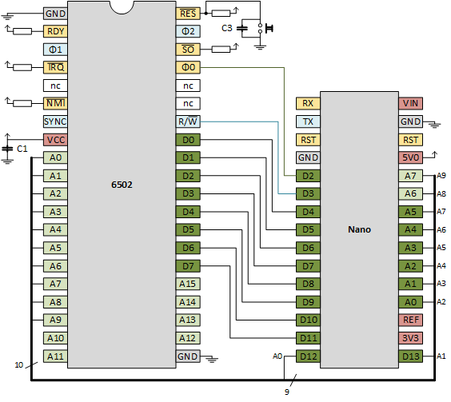
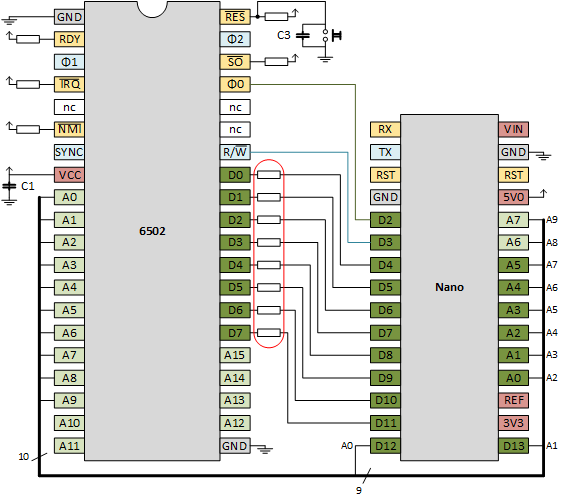

# Emulation
Trying to build a 6502 based computer.

We have (see [previous chapter](..\1clock)) a 6502 in free run: it executes NOP, NOP, NOP, ... and by inspecting
the address lines (either having LEDs on the high lines, or using the scope on the low lines) we observe the addresses change.

But are we sure the 6502 is doing what we expect? Is it really starting at address EAEA (the reset vector at FFFC and FFFD also 
reads EA and EA) and then progressing to EAEB, EAEC? Would be nice if we can check that. 

Then I had a nice idea: the Nano controls the clock, so it knows when the address bus is valid, can't the Nano snoop it?
Can't we snoop (read) the data bus as well? Can't we _write_ the data bus? Yes, yes, and yes.

## 1 Clock

The [first step](https://github.com/maarten-pennings/6502/tree/master/1clock#clock---nano---wiring) was taken in the 
previous chapter. We used a Nano as a clock source for the 6502. The address lines are dangling, the data lines are hardwired to EA 
(the opcode of the NOP instruction). We had a very simple sketch that flips the clock line, and behold we had a 6502 
"free" running at 160kHz.

## 2 Address bus

With the first experiment, we believe the 6502 is executing NOPs. Can we check that? Can we check that it starts at EAEA 
(the reset vector at FFFC and FFFD also reads EA and EA) and then progressing to EAEB, EAEC? Can we spy the address bus?

Since the Nano generates the clock, we know when we have to sample the address bus.
Does the Nano have enough inputs? It seems to have D0..D13 so 14 lines.
However D0 and D1 [double](https://www.theengineeringprojects.com/wp-content/uploads/2018/06/introduction-to-arduino-nano-13-1.png) 
as RXD and TXD and we need those two pins to send the trace to the PC (over USB). That leaves us with 12 lines, where 16 would be nice.
From the [pinout](https://www.theengineeringprojects.com/wp-content/uploads/2018/06/introduction-to-arduino-nano-13-1.png)
we see that analog pins A0..A5 also have a double role, they can act as digital pins. That's 6 more digital pins. 

In other words, we have 18 digital pins. We need 1 for clock and 16 far the address lines. Even one spare.


The schematics above looks like this on my breadboard:


The program on the Nano, [AddrSpy6502](addrspy6502) is simple. The `loop()` pulses the clock, 
reads all 16 address lines and prints them out in hex (with a time stamp).
```cpp
void loop() {
  // Send clock low
  digitalWrite(PIN_CLOCK, LOW);
  // Send clock high again
  digitalWrite(PIN_CLOCK, HIGH);
  
  // Read address bus
  uint16_t addr=0 ;
  addr += digitalRead(PIN_ADDR_0 ) << 0;
  addr += digitalRead(PIN_ADDR_1 ) << 1;
  ...
  addr += digitalRead(PIN_ADDR_15) << 15;

  // Print address bus
  char buf[32];
  sprintf(buf,"%9ldus %04x",micros(),addr);
  Serial.println(buf);
}
```

This is the experiment I did.
- I pressed the reset button of the Nano down, and with the same hand I pressed the reset button of the 6502 down.
- I cleared the output of the Arduino terminal
- I released the reset of the Nano.
- As soon as I saw the first output of the Nano, I released the reset of the 6502.
- I disabled autoscroll in the terminal and copied the trace.

This was the trace (I manually added the `<- reset released`)

```
Welcome to AddrSpy6502
      400us 3586
      828us 3586
     1264us 3586
     1704us 3586
     2928us 3586
     4460us 3586
     5988us 3586
     7520us 3586
        ...  
   406848us 3586
   408380us 3586
   409908us 3586 <- reset released
   411440us 3586
   412968us 01ee
   414500us 01ed
   416028us 01ec
   417556us fffc
   419088us fffd
   420620us eaea
   422148us eaeb
   423680us eaeb
   425208us eaec
   426740us eaec
   428268us eaed
   429800us eaed
   431328us eaee
   432860us eaee
   434388us eaef
   435916us eaef
   437448us eaf0
   438980us eaf0
   440508us eaf1

```

Note that the first ~400 000 us of the Nano trace, the 6502 was still in reset.
It had a random pattern on the address bus, in this case 3586 (hex).
Just before 409908us I released the reset of the 6502 (you can't see that, it's my guess).

What we see on the address bus can be found in the 6502 datasheet, but is also very well explained
on the [6502.org site](http://www.6502.org/tutorials/interrupts.html#1.3):

```
                 // 6502 reset released
   409908us 3586 // first internal administrative operation of 6502
   411440us 3586 // second internal operation
   412968us 01ee // push of return address (PCH) on stack, decrement stack pointer (note S is EE)
   414500us 01ed // push the return address (PCL) on stack, decrement stack pointer (note S is ED)
   416028us 01ec // push the processor status word (PSW) on stack, decrement stack pointer (note S is EC)
   417556us fffc // get PCL from reset vector (FFFC), presumably reads EA
   419088us fffd // get PCH from reset vector (FFFD), presumably reads EA
   420620us eaea // Jump to reset vector, indeed EAEA. Executes first instruction (NOP)
   422148us eaeb // Executes 2nd instruction (NOP)
   423680us eaeb // Executes 2nd instruction (NOP)
   425208us eaec // Executes 3rd instruction (NOP)
   426740us eaec // Executes 3rd instruction (NOP)
```

Some notes
 - All three interrupts, NMI with vector at FFFA, RESET with vector at FFFC and IRQ with vector at FFFE
   have the same 7-clock interrupt sequence. 
 - One exception: for RESET the three pushes are fake: the 6502 issues a _read_ to the memory instead of a _write_.
 - The stack pointer (S) has a random value after reset, in the above run it happened to be EE.
   The stack page is hardwired to 01 on the 6502.
 - A NOP is two cycles, and we see that after RESET the address bus indeed changes every other step.
 - I can not explain why the first NOP only takes one clock.
 - The time between the trace lines (one clock period) is about 1500us, so we are running at 0.7kHz


## 3 Jump loop

The previous experiment is a success: we see the address lines increment nicely (in steps of two)
and also the reset behavior is as documented. Still, it would be nice to have a more realistic program;
a series of NOPs is not very convincing.

However, without a memory to store our program, we are limited in our possibilities.
There is one way out: go old style. Write a program in _hardware_.

I got the idea from [James Calvert's tight loop](http://mysite.du.edu/~jcalvert/tech/6504.htm).
We make some logic that emulates an 8 byte program.
We NOR together the first three address lines to create the "v-signal".
The v-signal is bound to D2, D3 and D6, the other data lines (D0, D1, D4, D5 and D7) are bound to GND.
So, the data bus is 0b 0v00 vv00. This means that 
 - if v=0 then D = 0b 0000 0000 = 0x00
 - if v=1 then D = 0b 0100 1100 = 0x4C

For the various addresses, that gives the following data reads:

  | address (hex) | address (bin) | v-signal| data |
  |:-------------:|:-------------:|:-------:|:----:|
  |     ...       |       ...     |         |      |
  |     FFFC      |    ... 100    |    0    |  00  | 
  |     FFFD      |    ... 101    |    0    |  00  |
  |     FFFE      |    ... 110    |    0    |  00  |
  |     FFFF      |    ... 111    |    0    |  00  |
  |     0000      |    ... 000    |    1    |  4C  |
  |     0001      |    ... 001    |    0    |  00  |
  |     0002      |    ... 010    |    0    |  00  |
  |     0003      |    ... 011    |    0    |  00  |
  |     ...       |       ...     |         |      |

In other words, at FFFC, the 6502 reads the start address 00 00, and at 0000 the 6502 reads 4C 00 00.
Note that 4C 00 00 means JMP 0000, since 4C is the opcode for JMP abs.

This the schematic


Here is a photo of my board. Note the _triple OR_ (4075) and the _hex inverter_ (7404) chips on the right.
Also note the three blue wires coming in (from A0, A1, A2) and the blue wire going out (to D2, d3 and D6).


With the same [sketch](addrspy6502) as the previous experiment, let's make a trace again.
We repeat our manual steps: Nano reset down, 6502 reset down, Nano reset up, wait for output, 6502 reset up.
This is the trace (I manually added the `<- reset released`) 

```
Welcome to AddrSpy6502
      400us 0001
      820us 0001
     1248us 0001
     1676us 0001
        ...
   263028us 0001
   264560us 0001
   266088us 0001
   267620us 0001
   269148us 0001
   270680us 0001 <- reset released
   272208us 0001
   273740us 01fa
   275268us 01f9
   276800us 01f8
   278328us fffc
   279856us fffd
   281388us 0000
   282920us 0001
   284448us 0002
   285980us 0000
   287508us 0001
   289040us 0002
   290568us 0000
   292100us 0001
   293628us 0002
```

Some notes
 - Before 270680us the reset is released (can't see that from the trace). 
 - We see the two internal administrative operations
 - We see the (fake) push of PCH, PCL, PSW.
   The stack pointer S now starts at FA, so pushes to 01FA, 01F9 and 01F8.
 - We see the reset vector load (FFFC, FFFD)
 - We see the load of 0000 (this confirms that FFFC and FFFD read 00 00)
 - We see the load of 0001, 0002
 - We see the load of 0000 again, which hints that JMP 0000 was executed
 - One clock is still about 1500us (0.7kHz)


## 4 Data bus

In the notes on the previous experiment, we have " load of 0000 (this confirms that FFFC and FFFD read 00 00)".
Wouldn't it be nice if we could not only see the _address_ bus, but also the _data_ bus?
We can, but we loose details on the address bus.

Recall that we have Nano D2 for the 6502 ϕ0 (clock), and Nano D4..D13 plus A0..A5 for 6502 A0..A15.
This leaves Nano D3, A6 and A7 free.
Let's redesign.

 - Leave Nano D2 to R6502 ϕ0 (clock).
 - Connect Nano D3 to R6502 R/nW so that we can trace if the 6502 did a read or a write on the data bus.
 - Use Nano D4..D11 for 6502 data bus D0..D7. Full data trace.
 - Use Nano D12, D13, A0..A7 for 6502 A0..A9. Thus 10 bit address trace.



Find below my breadboard version. I still have the JMP loop circuit (3-input OR with inverter) on the right.


There is one problem with this wiring: Nano A6 and A7 are analog only.
We cannot use `digitalRead()` on those pins.
We can however read them in an analog fashion by using `analogRead()` and comparing the result with half the 
maximum analog readout: 1024/2.
The drawback is that `analogRead()` is [slow](https://www.arduino.cc/reference/en/language/functions/analog-io/analogread/):

> On ATmega based boards (UNO, Nano, Mini, Mega), it takes about 100 microseconds (0.0001 s) 
> to read an analog input, so the maximum reading rate is about 10,000 times a second.

We prefer to use 10 bits, because this means we have 4 pages (a 6502 page is 256 bytes):
 - page 0, for well, zero-page addressing of the 6502
 - page 1, for the stack (hardwired on page 1 by the 6502)
 - page 2, for the code
 - page 3, for the interrupt vectors (hardwired to FFFx by the 6502)

The result is a memory map with 4 pages of each 256 bytes (so 1kB in total), that is mirrored 64 times:


The associated [Arduino sketch](addrdataspy6502), now also captures R/nW and the data pins:

```cpp
void loop() {
  // Send clock low
  digitalWrite(PIN_CLOCK, LOW);
  // Send clock high again
  digitalWrite(PIN_CLOCK, HIGH);
  
  // Read address bus
  uint16_t addr=0 ;
  addr += digitalRead(PIN_ADDR_0) << 0;
  addr += digitalRead(PIN_ADDR_1) << 1;
  ...

  // Read R/nW
  uint16_t rnw=0 ;
  rnw += digitalRead(PIN_RnW) << 0;
  
  // Read data bus
  uint16_t data=0 ;
  data += digitalRead(PIN_DATA_0) << 0;
  data += digitalRead(PIN_DATA_1) << 1;
  ...

  // Print address bus
  char buf[32];
  sprintf(buf,"%9ldus %03x %0x %02x",micros(),addr,rnw,data);
  Serial.println(buf);
}
```

The results are great. We made a trace in the same way as before

```
Welcome to AddrDataSpy6502
      752us 002 1 00
     1504us 002 1 00
     2264us 002 1 00
     3024us 002 1 00
        ...
   376984us 002 1 00
   378856us 002 1 00 <- reset
   380736us 002 1 00
   382608us 1fd 1 00
   384464us 1fc 1 00
   386336us 1fb 1 00
   388216us 3fc 1 00
   390088us 3fd 1 00
   391944us 000 1 4c
   393816us 001 1 00
   395696us 002 1 00
   397568us 000 1 4c
   399424us 001 1 00
   401296us 002 1 00
   403176us 000 1 4c
   405048us 001 1 00
   406904us 002 1 00
```

 - Since we capture only 10 address lines, we only print 3 nibbles
 - The first nible of the address bus is only 0, 1, 2 or 3 (we only capture 2 bits in this nibble).
 - Since we still have the JMP loop wired, all bytes are read as 00 except at location 0000, there it reads 4C.
 - The three push instructions (01fd, 01fc, 01fb) are indeed fake: they read instead of write (R/nW flag is 1).
 - One clock is now just below 2000us (0.5kHz).


## 5 Interrupt (IRQ)

We should be able to generate an interrupt.
The IRQ line on the board is pulled up, so if we add a wire and toch the GND signal, we should get an interrupt.

> Intermezzo on interrupts

> The 6502 IRQ line is not edge but level sensitive: a low level causes an interrupt.
> In practice this is what happens. The IRQ line is sampled at the end of each instruction.

> If the line is high, no interrupt request is pending and the 6502 runs the next instruction
> till completion before it samples the IRQ line again.

> If the IRQ line is low, an interrupt request is pending. If the I flag ("IRQ-disable") in 
> the program status word is 1, the interrupt is not taken; the 6502 runs the next instruction
> till completion before it samples the IRQ line (and I flag) again.

> If the IRQ line is low and the I flag is 0, the interrupt sequence will be initiated. 
> The Program Counter (PC, high and low byte) and the Processor Status Word (PSW) are pushed 
> onto the stack and the IRQ-disable flag (I) is set to a 1 disabling further interrupts.
> The Program Counter Low is loaded from FFFE and the Program Counter High from FFFF.
> The vector at FFFE/FFFF point to the start of the so-called Interrupt Service Routine (ISR),
> which thus now starts to execute.

> The ISR should do the proper action for the interrupt, but also some administrative work:
> it should signal the device that caused the pulled the IRQ line low, that it is serviced, so 
> that it will let the IRQ line go high again. The ISR ends with a Return from Interrupt (RTI) 
> instruction. This restores the I flag (back to 0) and a new interrupts can be handled. 
> If the (I) flag is cleared in the ISR, nested interrupts can occur. 

So, if we pull IRQ low for a moment, the ISR will be executed (by default I=0).
This means the the main program (the JMP loop at 0000) is pre-empted and that the 6502 
will start executing ... 0000 (because FFFE and FFFF both store 00). 

We will see the interrupt sequnce!
Another interesting observation is that our ISR never returns.
It loops back to 0000 and never executes a RTI.
So after the first interrupt I=1, and no new interrupts will be serviced.
That is, till the next RESET.

Let's give it a try. Lets run the [tracer](addrdataspy6502) and short circuit
the nIRQ line of the 6502 with GND for a brief moment.

```
 62728408us 000 1 4c
 62730280us 001 1 00
 62732136us 002 1 00
 62734016us 000 1 4c
 62735888us 001 1 00
 62737744us 002 1 00 <- IRQ
 62739632us 000 1 4c
 62741496us 000 1 4c
 62743368us 100 0 00
 62745224us 1ff 0 00
 62747096us 1fe 0 00
 62748976us 3fe 1 00
 62750848us 3ff 1 00
 62752704us 000 1 4c
 62754576us 001 1 00
 62756456us 002 1 00
 62758328us 000 1 4c
 62760184us 001 1 00
 62762056us 002 1 00
```

 - We see the 6502 looping JMP 0000 call
 - At 62737744us there is the IRQ (you can not see that from this line)
 - We have the two internal cycles
 - We have the 3 pushes (to 100, 1ff, 1fe)
 - Note the the 3 pushes indeed have the R/nW flag being 0 (first time, jaayy)
 - We have a read from 3fe (FFFE) and 3ff (FFFF), remember we capture only 12 address bits 
 - Next, the program counter switches to 000
 - A second touch of the wire did not cause a second FFFE/FFFF lookup.

Success, interrupt fully matches our model.


## 6 Emulate ROM

The Nano now controls the clock of the 6502, but it also reads the (well, most) address lines.
And it is connected to the data lines. What prevents us from writing a sketch that has a 1k array (remember we
capture 10 address lines which can address 1024 locations), indexes that array with the received address, 
retrieves the byte at that location, and write the value of that byte to the data lines?

Nothing. This basically implements a ROM.

Since the Nano now writes to the data lines in addition to the 6502, there is a risky situation: if one 
writes 0 and the other writes 1, we get a short circuit. So I decided to add (1k) resistors on the line.
A 5V short then causes a 5mA current. Hope both chips can handle that. A 10k was too high for me.



I used an extra breadboard to insert the 1k resistors in the data lines:


The associated [Arduino sketch](rom6502), now looks up the data and writes it on the data lines:

```cpp
void loop() {
  // Send clock low
  digitalWrite(PIN_CLOCK, LOW);
  
  // Read address bus
  uint16_t addr=0 ;
  addr += digitalRead(PIN_ADDR_0) << 0;
  addr += digitalRead(PIN_ADDR_1) << 1;
  ...
  
  // Read R/nW
  uint16_t rnw=0 ;
  rnw += digitalRead(PIN_RnW) << 0;
  
  // Write data bus
  uint16_t data= mem[addr] ;
  digitalWrite(PIN_DATA_0, (data&(1<<0))?HIGH:LOW );
  digitalWrite(PIN_DATA_1, (data&(1<<1))?HIGH:LOW );
  ...
  
  // Send clock high again
  digitalWrite(PIN_CLOCK, HIGH);

  // Print address bus
  char buf[32];
  sprintf(buf,"%9ldus %03x %0x %02x",micros(),addr,rnw,data);
  Serial.println(buf);
}
```

The `mem` array that is used to lookup `data` is a byte array that is initialized by calling `load()` from `setup()`.

```cpp
uint8_t mem[1024];

void load() {
  // Fill entire memory with NOP
  for(int i=0; i<1024; i++ ) mem[i]=0xEA; // NOP

  // * = $0200
  mem[0x3fc]= 0x00;
  mem[0x3fd]= 0x02;
  // 0200        LDX #$00        A2 00
  mem[0x200]= 0xA2;
  mem[0x201]= 0x00;
  // 0202 LOOP   INX             E8
  mem[0x202]= 0xE8;
  // 0203        STX $0155       8E 55 01
  mem[0x203]= 0x8E;
  mem[0x204]= 0x55;
  mem[0x205]= 0x01;
  // 0206        JMP LOOP        4C 02 02
  mem[0x206]= 0x4C;
  mem[0x207]= 0x02;
  mem[0x208]= 0x02;
}
```

In case you wonder where this code is coming from.
I wrote a simple assembler program that constantly increments X and stores it on location 155
(not wise, since that is in the stack area, but hey, we use no stack).
This is the assembler code

```asm
* = $0200
0200        LDX #$00        A2 00
0202 LOOP   INX             E8
0203        STX $0155       8E 55 01
0206        JMP LOOP        4C 02 02
```

I used the [on-line 6502 compiler](https://www.masswerk.at/6502/assembler.html) to get the opcodes.
Do not forget the reset vector at 3fc and 3fd.

This is the trace

```
Welcome to Rom6502
     1132us 206 1 4c
     1892us 206 1 4c
     2660us 206 1 4c
        ...
   312740us 206 1 4c
   314588us 206 1 4c
   316468us 206 1 4c
   318348us 206 1 4c <- reset
   320220us 206 1 4c
   322068us 1ab 1 ea
   323940us 1aa 1 ea
   325828us 1a9 1 ea
   327708us 3fc 1 00
   329548us 3fd 1 02
   331420us 200 1 a2 <- main
   333308us 201 1 00
   335180us 202 1 e8 <- loop
   337028us 203 1 8e
   338900us 203 1 8e
   340788us 204 1 55
   342660us 205 1 01
   344508us 155 0 ea <- save X
   346380us 206 1 4c
   348268us 207 1 02
   350140us 208 1 02
   351988us 202 1 e8 <- loop
   353860us 203 1 8e
   355748us 203 1 8e
   357620us 204 1 55
   359476us 205 1 01
   361340us 155 0 ea <- save X
   363228us 206 1 4c
   365100us 207 1 02
   366948us 208 1 02
   368820us 202 1 e8 <- loop
   370716us 203 1 8e
```

- After reset, the 6502 jumps to main at 200.
- It executes the `LDX #$00` and then moves to the start of the loop.
- In the loop, it increments X `INX` or `E8`
- Then executes the store of X to 155 `STX $0155` which takes four ticks `8E 8E 55 01`
- The 6502 attempts to write (R/nW is 0) but our "ROM" (the Nano) does ignore this. 
  The Nano actually writes `EA` causing the dreaded short circuit (but save due to the resistors).
- Finally there is the jump to loop `JMP 0202`.


## 7 Emulate RAM

In the previous section we implemented a ROM: the 6502 could _read_ bytes.
Those bytes come from a memory array inside the Nano.

In this section we will extend the Nano firmware.
It will accept _writes_ from the 6502; the written bytes will be written to memory array inside the Nano.

The schematics and breadboard do not change; it is just the firmware inside the Nano.
This is the important part:

```cpp
void loop() {
  // Send clock low
  digitalWrite(PIN_CLOCK, LOW);
  
  // Read address bus
  uint16_t addr=0 ;
  addr += digitalRead(PIN_ADDR_0) << 0;
  addr += digitalRead(PIN_ADDR_1) << 1;
  ...
  
  // Read R/nW
  uint8_t rnw=0 ;
  rnw += digitalRead(PIN_RnW) << 0;

  // Send clock high again
  digitalWrite(PIN_CLOCK, HIGH);

  // Write or read depends on R/nW
  uint8_t data;
  if( rnw ) { // R/nW==1, so 6502 reads, so Nano writes
    data= mem[addr];
    data_write(data);
  } else { // R/nW==0, so 6502 writes, so Nano reads
    data= data_read();
    mem[addr]= data;
  }

  // Print address bus
  char buf[32];
  sprintf(buf,"%9ldus %03x %0x %02x",micros(),addr,rnw,data);
  Serial.println(buf);
}
```

Those who have been following my experiments might notice that I'm not consistent with the 
placement of the clock changes `digitalWrite(PIN_CLOCK,LOW)` and `digitalWrite(PIN_CLOCK,HIGH)`.
The truth is, I do not fully understand what the relation is between the clock edges and 
the moments to read the address, R/nW line, or access the data lines.

This is the trace:

```
Welcome to Ram6502
Memory loaded
     1248us 314 1 ea
     2048us 001 1 ea
     2848us 001 1 ea
   394464us 001 1 ea    <- RESET
   396324us 001 1 ea    // Internal 
   398200us 001 1 ea    // Internal 
   400072us 100 1 ea    // Push PCH
   401928us 1ff 1 ea    // Push PCL
   403808us 1fe 1 ea    // Push PSW
   405680us 3fc 1 00    // LD PCL
   407536us 3fd 1 02    // LD PCH
   409408us 200 1 a9 // LDA #$00 
   411280us 201 1 00
   413160us 202 1 85 // STA *$33
   415032us 203 1 33
   416888us 033 0 00    <- store 0 in 33
   418760us 204 1 e6 // INC *$33
   420640us 205 1 33
   422496us 033 1 00    <- gets 0 from 33
   424368us 033 1 00 
   426240us 033 0 01    <- store 1 in 33
   428124us 206 1 4c // JMP 0204
   429976us 207 1 04 
   431848us 208 1 02
   433720us 204 1 e6 // INC *$33
   435600us 205 1 33 
   437472us 033 1 01    <- gets 1 from 33
   439332us 033 1 01 
   441200us 033 0 02    <- store 2 in 33
   443080us 206 1 4c
   444936us 207 1 04
   446816us 208 1 02
```

The clock steps are still 2000us or 0.5kHz.

## 8 Test IRQ

Now that we have RAM operational, we can really test interrupts.
We did that before (by grounding nIRQ), but we could do that only one time (after reset).
The reason is that as part of the IRQ handling (the 7 steps of interrupt handling), the 6502 automatically 
sets the I flag (also known as IRQ-disable flag) to 1. From that moment on, IRQs are disabled.

The I flag is cleared by the `RTI` instruction, since that pops the old PSW register (which contains the I flag). 
Now that we have RAM emulation, the push of PSW is operational, so the pop of PSW is effective.

The new Nano sketch [ramirq6502](ramirq6502) is identical to the previous [ram6502](ram6502) with one exception.
The `mem` array is loaded with a different firmware for the 6502.

There are two functions. The `main` gets executed from the reset vector

```asm
* = $0200
0200 MAIN
0200        CLI             58
0201        LDA #$00        A9 00
0203        STA *$33        85 33
0205        STA *$44        85 44
0207 LOOP   
0207        INC *$33        E6 33
0209        JMP LOOP        4C 07 02
```

In its `loop` it increments zero page location 33.

Before the loop, it initializes zero page location 33 to 00.
It has two other initliazations: zero page location 44 to 00, and enabling of interupts (`CLI`).
The enabling of interrupts allows the second function `isr` to be called when grounding the nIRQ line.
The `isr` increments zero page location 44.

```asm
* = $0300
0300 ISR
0300        INC *$44        E6 44
0302        RTI             40
```

All these opcode bytes are written to the `mem[]` array in `mem_load()`.
Do not forget that `mem-load(0` should initialize mem locations fffc/fffd (reset) and fffe/ffff (irq).

This is the annotated trace.

```
Welcome to RamIrq6502
200: 58 a9 00 85 33 85 44 e6 33 4c 07 02 ea ea ea ea
300: e6 44 40 ea ea ea ea ea ea ea ea ea ea ea ea ea
3f0: ea ea ea ea ea ea ea ea ea ea ea ea 00 02 00 03
Memory loaded
    12192us 2f1 1 ea
    13904us 2f1 1 ea
    15776us 2f1 1 ea
        ...
   290664us 2f1 1 ea
   292536us 2f1 1 ea <- reset
   294416us 2f1 1 ea    // internal
   296288us 2f1 1 ea    // internal
   298144us 139 1 ea    // push PCH
   300016us 138 1 ea    // push PCL
   301896us 137 1 ea    // push PSW
   303752us 3fc 1 00    // LD PCL
   305624us 3fd 1 02    // LD PCH
   307496us 200 1 58 <- main
   309376us 201 1 a9
   311248us 201 1 a9
   313104us 202 1 00
   314976us 203 1 85
   316856us 204 1 33
   318728us 033 0 00 <- clear 33
   320588us 205 1 85
   322456us 206 1 44
   324336us 044 0 00 <- clear 44
   326192us 207 1 e6 <- loop
   328064us 208 1 33
   329952us 033 1 00
   331820us 033 1 00
   333672us 033 0 01 <- update 33
   335544us 209 1 4c
   337416us 20a 1 07
   339296us 20b 1 02
   341152us 207 1 e6 <- loop
   343024us 208 1 33 
   344896us 033 1 01 
   346776us 033 1 01 
   348632us 033 0 02 <- update 33
   350504us 209 1 4c
   352376us 20a 1 07
   354256us 20b 1 02
        ...
  1741784us 209 1 4c
  1743656us 20a 1 07
  1745536us 20b 1 02
  1747408us 207 1 e6
  1749264us 208 1 33
  1751140us 033 1 5f
  1753016us 033 1 5f
  1754888us 033 0 60 <- IRQ (when PC=209)
  1756744us 209 1 4c    // internal
  1758616us 209 1 4c    // internal
  1760496us 136 0 02    // push PCH 
  1762372us 135 0 09    // push PCL
  1764224us 134 0 60    // push PSW
  1766096us 3fe 1 00    // LD PCL
  1767976us 3ff 1 03    // LD PCH
  1769848us 300 1 e6 <- ISR
  1771704us 301 1 44
  1773580us 044 1 00
  1775456us 044 1 00
  1777328us 044 0 01 <- update 44
  1779184us 302 1 40 <- RTI
  1781064us 303 1 ea    //
  1782936us 133 1 ea    // 
  1784808us 134 1 60    // pop PSW
  1786664us 135 1 09    // pop PCL
  1788536us 136 1 02    // pop PCH
  1790416us 209 1 4c <- back in main 
  1792288us 20a 1 07
  1794148us 20b 1 02
  1796016us 207 1 e6 <- loop
  1797896us 208 1 33 
  1799768us 033 1 60 
  1801624us 033 1 60 
  1803496us 033 0 61 <- update 33
  1805380us 209 1 4c
  1807248us 20a 1 07
  1809104us 20b 1 02
```

## Conclusion

We have a 6502 with some passives (pull-ups, caps) and a Nano.
The Nano implements the rest of the system: memory and clock.
And it povides a trace facility.

This is a great way to investigate the behavior of the 6502.
And it offers an easy start, nextt to the 6502 only a nano is needed.
