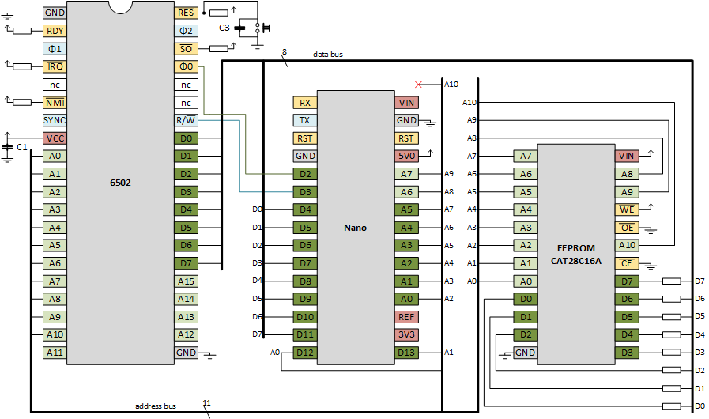

# EEPROM
Trying to build a 6502 based computer.

We need a memory to store a program that executes on reset.
This program could be a basic interpreter or monitor.
This memory needs to preserve data over power down.
So we go for a ROM, actually a programmable ROM (PROM).
We make mistakes so let it be an EPROM (eraseble PROM), 
and in this age that will be an EEPROM (electrically erasable PROM).

I found the AT28C16, a 2kB EEPROM.
I also found a [Youtube video by Ben Eater](https://youtu.be/K88pgWhEb1M) 
that explained how to make a programmer for it using a Nano.

This is the schematic of my _Arduino EEPROM programmer_:


And this a picture of my breadboard:


The Nano in the Arduino EEPROM programmer needs a sketch.
With [this sketch](eeprom-programmer) you can connect to the Nano via a terminal program (UART over USB), 
and give the Nano commands to write or read EEPROM locations. 

The programmer has LEDs which show the current address and data.
The two buttons allows the user to go to next or previous address.
So, this is an alternative to the USB interface, but only allows reading.

Instead of entering commands manually over the UART/USB, one can also send a file 
(keep in mind that the Nano is less fast then your PC, so you should typically configure 
the terminal to have a character or line delay - I use a line delay of 10ms).
Such a file could be called an EEPROM programming script.
Two example scripts are given
 - [simple](eeprom-programmer/inx-loop.txt)
 - [elaborated](eeprom-programmer/main33inc-isr44inc.txt)

The latter script is the same program that we used in the [previous chapter](../2emulation/README.md#8-Test-IRQ).
This is the output of the script.


```
>> @echo disable                                                                
                                                                                
Program MAIN                                                                    
------------                                                                    
7fc: 00 02                                                                      
200: (*                                                                         
200: 58                                                                         
201: a9 00                                                                      
203: 85 33                                                                      
205: 85 44                                                                      
207: e6 33                                                                      
209: *)                                                                         
                                                                                
Program ISR                                                                     
-----------                                                                     
7fe: 00 03                                                                      
300: (*                                                                         
300: e6 44                                                                      
302: 40                                                                         
303: *)                                                                         
                                                                                
Dump                                                                            
----                                                                            
200: 58 a9 00 85 33 85 44 e6 33 ff ff ff ff ff ff ff                            
300: e6 44 40 ff ff ff ff ff ff ff ff ff ff ff ff ff                            
7f0: ff ff ff ff ff ff ff ff ff ff ff ff 00 02 00 03                            
                                                                                
Verify                                                                          
------                                                                          
verify: 0 errors                                                                
```

Using the Arduino EEPROM programmer I have programmed an EEPROM, and connected it to an 6502.
The Nano will run the [address and data tracer]("../2emulation/addrdataspy6502") from the previous chapter.
We have wired the EEPROM to be always in output mode (nCE and nOE are connected to GND).
The Nano firmware ensures that data pins are always in input mode. That is safe.
But the 6502 data pins could be in output as well (when the 6502 pushes or stores).
Therefore, I have added resistors between the EEPROM and the 6502.



Since we are still using a Nano for the clock, we can still trace. 
This is the result.

```
Welcome to AddrDataSpy6502
       760us 031 1 ff
      1516us 031 1 ff
      2280us 031 1 ff
      3040us 031 1 ff
         ...
    302184us 031 1 ff
    304056us 031 1 ff
    305936us 031 1 ff
    307808us 031 1 ff 
    309664us 031 1 ff <-RST internal 
    311536us 031 1 ff       internal
    313416us 1fd 1 08       PUSH PCH
    315288us 1fc 1 31       PUSH PCL
    317144us 1fb 1 21       PUSH PSW
    319016us 3fc 1 00       LD PCL
    320896us 3fd 1 02       LD PCH
    322768us 200 1 58 CLI
    324640us 201 1 a9 LDA #00
    326496us 201 1 a9 |
    328376us 202 1 00 |
    330248us 203 1 85 STA *33
    332104us 204 1 33 |
    333976us 033 0 00 | 
    335856us 205 1 85 STA *44
    337728us 206 1 44 |
    339584us 044 0 00 |
    341456us 207 1 e6 INC *33
    343336us 208 1 33 |
    345208us 033 1 ff |
    347064us 033 1 ff |
    348936us 033 0 00 |
    350816us 209 1 4c JMP 0207
    352688us 20a 1 07 |
    354544us 20b 1 02 |
    356416us 207 1 e6  |INC *33
    358296us 208 1 33  |
    360168us 033 1 ff  |
    362024us 033 1 ff  |
    363896us 033 0 00  |
    365776us 209 1 4c  JMP 0207
    367656us 20a 1 07  |
    369504us 20b 1 02  |
    371376us 207 1 e6 |INC *33
    373256us 208 1 33 |
    375128us 033 1 ff |
    376984us 033 1 ff |
    378856us 033 0 00 |
    380736us 209 1 4c JMP 0207
    382608us 20a 1 07 |
    384464us 20b 1 02 |
         ...
1652968504us 207 1 e6 |INC *33
1652970456us 208 1 33 |
1652972392us 033 1 ff |
1652974368us 033 1 ff |
1652976320us 033 0 00 |
1652978264us 209 1 4c JMP 0207
1652980232us 20a 1 07 |
1652982176us 20b 1 02 |
1652984128us 207 1 e6  |INC *33
1652986096us 208 1 33  |
1652988032us 033 1 ff  |
1652990016us 033 1 ff  |
1652991960us 033 0 00  |
1652993904us 209 1 4c  JMP 0207
1652995872us 20a 1 07  |
1652997816us 20b 1 02  |
1652999768us 207 1 e6 |INC *33
1653001736us 208 1 33 |
1653003672us 033 1 ff |
1653005648us 033 1 ff |
1653007600us 033 0 00 |
1653009544us 209 1 4c  <-IRQ internal
1653011520us 209 1 4c        internal
1653013456us 1fa 0 02        PUSH PCH
1653015408us 1f9 0 09        PUSH PCL
1653017376us 1f8 0 23        PUSH PSW
1653019312us 3fe 1 00        LD PCL
1653021288us 3ff 1 03        LD PCH
1653023232us 300 1 e6 | INC *44
1653025184us 301 1 44 |
1653027152us 044 1 ff |
1653029096us 044 1 ff |
1653031048us 044 0 00 |
1653033024us 302 1 40 | RTI
1653034952us 303 1 ff |
1653036928us 1f7 1 ff |
1653038872us 1f8 1 ff |
1653040824us 1f9 1 ff |
1653042792us 1fa 1 ff |
1653044736us 3ff 1 03 <- crash, PC could not be popped
1653046688us 000 1 ff
1653048656us 001 1 ff
1653050592us 0ff 1 ff
1653052568us 0ff 1 ff
1653054528us 002 1 ff
1653056464us 003 1 ff
```

Note that we also tried IRQ, but since there is no RAM yet, this crashes (when popping the return address using `RTI`).
