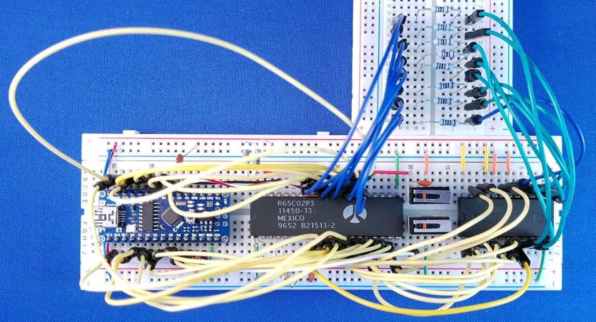

# EEPROM
Trying to build a 6502 based computer.

We need a memory to store a program that executes on reset.
This program could be, for example, a basic interpreter, a monitor or some OS shell.
This memory needs to preserve data over power down.
So we go for a ROM, actually a _programmable_ ROM, a PROM.
We make mistakes so let it be an eraseble PROM, a EPROM, 
and in this age that will be an electrically erasable PROM, an EEPROM.

So, we will attach an EEPROM to our 6502, so that the 6502 has code to execute upon reset.
We get another problem: how do we program that EEPROM.
With an EEPROM programmer.

I found the [AT28C16](https://www.aliexpress.com/item/32984222148.html), a 2kB EEPROM.
I also found a [Youtube video by Ben Eater](https://youtu.be/K88pgWhEb1M) 
that explained how to make a programmer for it using a Nano.


## EEPROM programmer - design

Programming the [AT28C16](https://opencircuit.shop/ProductInfo/1001018/CAT28C16A-Datasheet.pdf) is fairly simple.
In steady state, the chip is powered (VC, VSS) and enabled (nOE).
To write a byte, set an address on its 11 address lines, data on its 8 data lines, and pulse nWE.
To read a byte, set an address on its 11 address lines, pull nOE low, read data from the 8 data lines, and release nOE to high.

We can write Nano firmware to do that.
One complication is that we need 8 data wires, 2 control wires (nWE, nOE) and 11 address wires.
The Nano does not have that. So we follow Ben's approach and use a shift register for the address wires.

Not for the data wires, because we want to read those as well.
And not for the control wires, because we want to time the pulses indenpedent from the address line changes.

The idea is to write firmware implements a command interpreter, which that allows 
commands (over UART/USB) to write bytes to memory locations

```
  >> write 7FC 00 02
  >> write 200 A9 00 85 33
```

but also has commands to read memory locations

```
  >> read 200 8
  200: A9 00 85 33 FF FF FF FF
```

I added LEDs to get feedback on the commands, and I liked that so much that I put them on all data and address lines.
Then I decided to add two buttons that allow the user (with the help of the Nano) to go to next or previous address.
So, this is an alternative to the USB interface, but only allows reading.


## EEPROM programmer - hardware

This is the schematic of my _Arduino EEPROM programmer_:


And this a picture of my breadboard:


## EEPROM programmer - firmware

The Nano in the Arduino EEPROM programmer needs a sketch.
I ended up with nearly a "product quality" [sketch](eeprom-programmer).
If you want less, copy only the "EEPROM" section.

You can connect to the Nano via a terminal program (UART over USB), 
and give the Nano commands to write or read EEPROM locations. 
See below for a demo session.


Instead of entering commands manually over the UART/USB, one can also send a file with commands.
Such a file could be called an EEPROM programming script.

> Keep in mind that the Nano is less fast then your PC.
> So the PC will send to characters in the file so fast to the Nano that it can't keep up.
> You should typically configure the terminal to have a per character or per line delay when sending files.
> I use a line delay of 25ms.

Two example scripts are given. The first [script](eeprom-programmer/inx-loop.txt) 
uses series of `write` commands. The second [script](eeprom-programmer/main33inc-isr44inc.txt) is more elaborated.
It uses streaming mode, `echo` commands to keep track of progress, and verifies if writing was succesful.
It is the same program that we used in the [previous chapter](../2emulation/README.md#8-Test-IRQ).
We used it for the experiment started in the next section.


## 6502 with EEPROM - program

We use the same program as in the previous section.
The main loop increments zero pages address 33 
and the ISR routine (when an interrupt occurs) increments zero page address 44.

```
0200 MAIN
0200        CLI
0201        LDA #$00
0203        STA *$33
0205        STA *$44
0207 LOOP
0207        INC *$33
0209        JMP LOOP

0300 ISR
0300        INC *$44
0302        RTI
```

To write this program to the EEPROM we wrote this [script](eeprom-programmer/main33inc-isr44inc.txt).
When sending it via a terminal to the Arduino EEPROM programmer, this is the output.

```
Program MAIN                                                                    
------------                                                                    
7fc: 00 02                                                                      
200: (*                                                                         
200: 58                                                                         
201: a9 00                                                                      
203: 85 33                                                                      
205: 85 44                                                                      
207: e6 33                                                                      
209: 4c 07 02                                                                   
20c: *)                                                                         
                                                                                
Program ISR                                                                     
-----------                                                                     
7fe: 00 03                                                                      
300: (*                                                                         
300: e6 44                                                                      
302: 40                                                                         
303: *)                                                                         
                                                                                
Dump                                                                            
----                                                                            
200: 58 a9 00 85 33 85 44 e6 33 4c 07 02 ff ff ff ff                            
300: e6 44 40 ff ff ff ff ff ff ff ff ff ff ff ff ff                            
7f0: ff ff ff ff ff ff ff ff ff ff ff ff 00 02 00 03                            
                                                                                
Verify                                                                          
------                                                                          
verify: 0 errors                                                              
```

## 6502 with EEPROM - hardware

Using the Arduino EEPROM programmer I have programmed an EEPROM, and connected it to an 6502.
The Nano will run the [address and data tracer]("../2emulation/addrdataspy6502") from the previous chapter.

We have wired the EEPROM to be always in output mode (nCE and nOE are connected to GND).
The Nano firmware ensures that data pins are always in input mode. That is safe.
But the 6502 data pins could be in output as well (when the 6502 pushes or stores).
Therefore, I have added resistors between the EEPROM and the 6502.

Here are the schematics


and here is a picture of my board 
(the second button hooks to the reset of the Nano, I couldn't reach it trough all the wires so I added some more :-)




## 6502 with EEPROM - run

Since we are still using a Nano for the clock, we can still trace. 
This is the result.

```
Welcome to AddrDataSpy6502
       760us 031 1 ff
      1516us 031 1 ff
      2280us 031 1 ff
      3040us 031 1 ff
         ...
    302184us 031 1 ff
    304056us 031 1 ff
    305936us 031 1 ff
    307808us 031 1 ff 
    309664us 031 1 ff <-RST internal 
    311536us 031 1 ff       internal
    313416us 1fd 1 08       PUSH PCH
    315288us 1fc 1 31       PUSH PCL
    317144us 1fb 1 21       PUSH PSW
    319016us 3fc 1 00       LD PCL
    320896us 3fd 1 02       LD PCH
    322768us 200 1 58 CLI
    324640us 201 1 a9 LDA #00
    326496us 201 1 a9 |
    328376us 202 1 00 |
    330248us 203 1 85 STA *33
    332104us 204 1 33 |
    333976us 033 0 00 | 
    335856us 205 1 85 STA *44
    337728us 206 1 44 |
    339584us 044 0 00 |
    341456us 207 1 e6 INC *33
    343336us 208 1 33 |
    345208us 033 1 ff |
    347064us 033 1 ff |
    348936us 033 0 00 |
    350816us 209 1 4c JMP 0207
    352688us 20a 1 07 |
    354544us 20b 1 02 |
    356416us 207 1 e6  |INC *33
    358296us 208 1 33  |
    360168us 033 1 ff  |
    362024us 033 1 ff  |
    363896us 033 0 00  |
    365776us 209 1 4c  JMP 0207
    367656us 20a 1 07  |
    369504us 20b 1 02  |
    371376us 207 1 e6 |INC *33
    373256us 208 1 33 |
    375128us 033 1 ff |
    376984us 033 1 ff |
    378856us 033 0 00 |
    380736us 209 1 4c JMP 0207
    382608us 20a 1 07 |
    384464us 20b 1 02 |
         ...
1652968504us 207 1 e6 |INC *33
1652970456us 208 1 33 |
1652972392us 033 1 ff |
1652974368us 033 1 ff |
1652976320us 033 0 00 |
1652978264us 209 1 4c JMP 0207
1652980232us 20a 1 07 |
1652982176us 20b 1 02 |
1652984128us 207 1 e6  |INC *33
1652986096us 208 1 33  |
1652988032us 033 1 ff  |
1652990016us 033 1 ff  |
1652991960us 033 0 00  |
1652993904us 209 1 4c  JMP 0207
1652995872us 20a 1 07  |
1652997816us 20b 1 02  |
1652999768us 207 1 e6 |INC *33
1653001736us 208 1 33 |
1653003672us 033 1 ff |
1653005648us 033 1 ff |
1653007600us 033 0 00 |
1653009544us 209 1 4c  <-IRQ internal
1653011520us 209 1 4c        internal
1653013456us 1fa 0 02        PUSH PCH
1653015408us 1f9 0 09        PUSH PCL
1653017376us 1f8 0 23        PUSH PSW
1653019312us 3fe 1 00        LD PCL
1653021288us 3ff 1 03        LD PCH
1653023232us 300 1 e6 | INC *44
1653025184us 301 1 44 |
1653027152us 044 1 ff |
1653029096us 044 1 ff |
1653031048us 044 0 00 |
1653033024us 302 1 40 | RTI
1653034952us 303 1 ff |
1653036928us 1f7 1 ff |
1653038872us 1f8 1 ff |
1653040824us 1f9 1 ff |
1653042792us 1fa 1 ff |
1653044736us 3ff 1 03 <- crash, PC could not be popped
1653046688us 000 1 ff
1653048656us 001 1 ff
1653050592us 0ff 1 ff
1653052568us 0ff 1 ff
1653054528us 002 1 ff
1653056464us 003 1 ff
```

Note that we also tried IRQ, but since there is no RAM yet, this crashes (when popping the return address using `RTI`).
