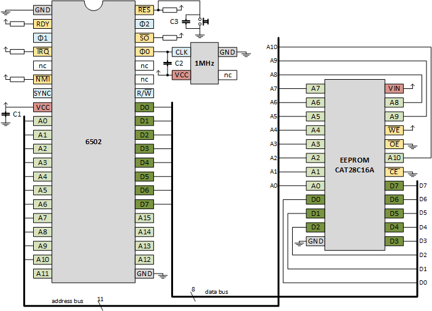

# 3. EEPROM
Trying to build a 6502 based computer.

We need a memory to store a program that executes on reset.
This program could be, for example, a basic interpreter, a monitor or some OS shell.
The memory needs to preserve data over power down.
So we go for a ROM, actually a _programmable_ ROM, a PROM.
We make mistakes so let it be an erasable PROM, a EPROM, 
and in this age that will be an _electrically_ erasable PROM, an EEPROM.

So, we will attach an EEPROM to our 6502, so that the 6502 has code to execute upon reset.
We get another problem: how do we program that EEPROM.
With an EEPROM programmer.

I found the [AT28C16](https://www.aliexpress.com/item/32984222148.html), a 2kB EEPROM.
I also found a [Youtube video by Ben Eater](https://youtu.be/K88pgWhEb1M) 
that explained how to make a programmer for it using a Nano.
That seemed like a good way to go.

We will do the following experiments
 - [3.1. EEPROM programmer](README.md#31-EEPROM-programmer) - Make our own EEPROM programmer with a Nano
 - [3.2. 6502 with EEPROM and Nano](README.md#32-6502-with-EEPROM-and-Nano) - Use a programmed EEPROM (6502+Nano)
 - [3.3. 6502 with EEPROM and oscillator](README.md#33-6502-with-EEPROM-and-oscillator) - Use a programmed EEPROM (6502+oscillator)
 - [3.4. Blinky](README.md#34-Blinky) - The "Hellow, world!" of embedded software: blinky


## 3.1. EEPROM programmer

### 3.1.1. Design of the EEPROM programmer

Programming the [AT28C16](https://opencircuit.shop/ProductInfo/1001018/CAT28C16A-Datasheet.pdf) is fairly simple.
In steady state, the chip is powered (VCC, VSS) and enabled (nCE).
To write a byte, set an address on its 11 address lines, data on its 8 data lines, and pulse nWE.
To read a byte, set an address on its 11 address lines, pull nOE low, read data from the 8 data lines, and release nOE to high.

We can write Nano firmware to do that.
One complication is that we need 8 data wires, 2 control wires (nWE, nOE) and 11 address wires.
The Nano does not have that. So we follow Ben's approach and use a shift register for the address wires.
We do not use the shift registers for the data wires, because we want to read the data as well.
And we also do not use the shift registers for the control wires, because we want to time the 
control pulses indepedent from the address line changes.

The idea is to write firmware that implements a _command interpreter_.
This command interpreter allows us to enter commands (over UART/USB) to write bytes to memory locations.
Here are examples of such commands.

```
  >> write 7FC 00 02
  >> write 200 A9 00 85 33
```

The command interpreter will also support commands to read memory locations, so that we can verify writes.

```
  >> read 200 8
  200: A9 00 85 33 FF FF FF FF
```

I added LEDs to the schematics to get direct feedback on the commands.
I liked that so much that in the end I put LEDs on all data and address lines.
Then I decided to add two buttons to allow the user (with the help of the Nano) to go to next or previous address.
The buttons form an alternative user interface, but only allows reading.


### 3.1.2. Hardware of the EEPROM programmer

This is the schematic of my _Arduino EEPROM programmer_:


And this a picture of my breadboard:


### 3.1.3. Firmware of the EEPROM programmer

The Nano in the Arduino EEPROM programmer needs a sketch.
I ended up with nearly a "product quality" [sketch](eeprom-programmer).
If you want less, copy only the "EEPROM" section.

You can connect to the Nano via a terminal program (UART over USB), 
and give the Nano commands to write or read EEPROM locations. 
See below for a demo session. 


The `>>` is the prompt. After the prompt I typed commands. The next line(s) are the response.

Instead of entering commands manually over the UART/USB, one can also send a file with commands.
Such a file could be called an EEPROM programming script.

> Keep in mind that the Nano is less fast then your PC.
> So the PC will send the characters in the file so fast to the Nano that it can't keep up.
> You should typically configure the terminal to have a per character or per line delay when sending files.
> I use a "line delay" of 25ms.

Some example scripts are given. Two, [inx-loop](eeprom-programmer/inx-loop.eeprom) and 
[stx-inx-loop](eeprom-programmer/stx-inx-loop.eeprom), uses series of `write` commands. 
Two others, [main33inc-isr44inc](eeprom-programmer/main33inc-isr44inc.eeprom) 
and [blinky](eeprom-programmer/blinky.eeprom) are more elaborated.
They use streaming mode, `echo` commands to keep track of progress, comments with `#`, 
and verifies at the end of the script if writing was successful.

The third program is the same program that we used in the [previous chapter](../2emulation/README.md#28-Test-IRQ).
We will now use it again. The fourth (blinky) will be used at the end of the chapter.


## 3.2. 6502 with EEPROM and Nano 

In this section, we are going to load an EEPROM with a program, hook the EEPROM to the 6502 and let it run.
To confirm correctness, we trace it with a Nano. The Nano thus also acts as clock.

For the 6502, we use the third program from the previous section.
The main loop increments zero pages address 33 
and the ISR routine (when an interrupt occurs) increments zero page address 44.

```
0200 MAIN
0200        CLI
0201        LDA #$00
0203        STA *$33
0205        STA *$44
0207 LOOP
0207        INC *$33
0209        JMP LOOP

0300 ISR
0300        INC *$44
0302        RTI
```

To write this program to the EEPROM we wrote this [script](eeprom-programmer/main33inc-isr44inc.eeprom).
When sending it via a terminal to the Arduino EEPROM programmer, this is the output.

```
Program MAIN                                                                    
------------                                                                    
7fc: 00 02                                                                      
200: (*                                                                         
200: 58                                                                         
201: a9 00                                                                      
203: 85 33                                                                      
205: 85 44                                                                      
207: e6 33                                                                      
209: 4c 07 02                                                                   
20c: *)                                                                         
                                                                                
Program ISR                                                                     
-----------                                                                     
7fe: 00 03                                                                      
300: (*                                                                         
300: e6 44                                                                      
302: 40                                                                         
303: *)                                                                         
                                                                                
Dump                                                                            
----                                                                            
200: 58 a9 00 85 33 85 44 e6 33 4c 07 02 ff ff ff ff                            
300: e6 44 40 ff ff ff ff ff ff ff ff ff ff ff ff ff                            
7f0: ff ff ff ff ff ff ff ff ff ff ff ff 00 02 00 03                            
                                                                                
Verify                                                                          
------                                                                          
verify: 0 errors                                                              
```

Once the EEPROM is programmed, we connect it to an 6502.
The Nano will run the [address and data tracer]("../2emulation/addrdataspy6502") from the previous chapter.

We have wired the EEPROM to be always in output mode (nCE and nOE are connected to GND).
The Nano firmware ensures that data pins are always in input mode. That is safe.
But the 6502 data pins could be in output as well (when the 6502 pushes or stores).
Therefore, I have added resistors between the EEPROM and the 6502.

Here are the schematics


and here is a picture of my board 
(the second button hooks to the reset of the Nano, I couldn't reach it trough all the wires so I added some more :-)


Since we are still using a Nano for the clock, we can still trace. 
This is the result.

```
Welcome to AddrDataSpy6502
       760us 031 1 ff
      1516us 031 1 ff
      2280us 031 1 ff
      3040us 031 1 ff
         ...
    302184us 031 1 ff
    304056us 031 1 ff
    305936us 031 1 ff
    307808us 031 1 ff 
    309664us 031 1 ff <-RST internal 
    311536us 031 1 ff       internal
    313416us 1fd 1 08       PUSH PCH
    315288us 1fc 1 31       PUSH PCL
    317144us 1fb 1 21       PUSH PSW
    319016us 3fc 1 00       LD PCL
    320896us 3fd 1 02       LD PCH
    322768us 200 1 58 CLI
    324640us 201 1 a9 LDA #00
    326496us 201 1 a9 |
    328376us 202 1 00 |
    330248us 203 1 85 STA *33
    332104us 204 1 33 |
    333976us 033 0 00 | 
    335856us 205 1 85 STA *44
    337728us 206 1 44 |
    339584us 044 0 00 |
    341456us 207 1 e6 INC *33
    343336us 208 1 33 |
    345208us 033 1 ff |
    347064us 033 1 ff |
    348936us 033 0 00 |
    350816us 209 1 4c JMP 0207
    352688us 20a 1 07 |
    354544us 20b 1 02 |
    356416us 207 1 e6  |INC *33
    358296us 208 1 33  |
    360168us 033 1 ff  |
    362024us 033 1 ff  |
    363896us 033 0 00  |
    365776us 209 1 4c  JMP 0207
    367656us 20a 1 07  |
    369504us 20b 1 02  |
    371376us 207 1 e6 |INC *33
    373256us 208 1 33 |
    375128us 033 1 ff |
    376984us 033 1 ff |
    378856us 033 0 00 |
    380736us 209 1 4c JMP 0207
    382608us 20a 1 07 |
    384464us 20b 1 02 |
         ...
1652968504us 207 1 e6 |INC *33
1652970456us 208 1 33 |
1652972392us 033 1 ff |
1652974368us 033 1 ff |
1652976320us 033 0 00 |
1652978264us 209 1 4c JMP 0207
1652980232us 20a 1 07 |
1652982176us 20b 1 02 |
1652984128us 207 1 e6  |INC *33
1652986096us 208 1 33  |
1652988032us 033 1 ff  |
1652990016us 033 1 ff  |
1652991960us 033 0 00  |
1652993904us 209 1 4c  JMP 0207
1652995872us 20a 1 07  |
1652997816us 20b 1 02  |
1652999768us 207 1 e6 |INC *33
1653001736us 208 1 33 |
1653003672us 033 1 ff |
1653005648us 033 1 ff |
1653007600us 033 0 00 |
1653009544us 209 1 4c  <-IRQ internal
1653011520us 209 1 4c        internal
1653013456us 1fa 0 02        PUSH PCH
1653015408us 1f9 0 09        PUSH PCL
1653017376us 1f8 0 23        PUSH PSW
1653019312us 3fe 1 00        LD PCL
1653021288us 3ff 1 03        LD PCH
1653023232us 300 1 e6 | INC *44
1653025184us 301 1 44 |
1653027152us 044 1 ff |
1653029096us 044 1 ff |
1653031048us 044 0 00 |
1653033024us 302 1 40 | RTI
1653034952us 303 1 ff |
1653036928us 1f7 1 ff |
1653038872us 1f8 1 ff |
1653040824us 1f9 1 ff |
1653042792us 1fa 1 ff |
1653044736us 3ff 1 03 <- crash, PC could not be popped
1653046688us 000 1 ff
1653048656us 001 1 ff
1653050592us 0ff 1 ff
1653052568us 0ff 1 ff
1653054528us 002 1 ff
1653056464us 003 1 ff
```

Note that we also tried IRQ, but since there is no RAM yet, this crashes (when popping the return address using `RTI`).

## 3.3. 6502 with EEPROM and oscillator

Would the EEPROM also work on full speed; 1MHz from a oscillator.
The problem is how to verify that.
My idea is to trace 4 address lines, the reset and the clock on an oscilloscope or logic analyser.
This is going to be painfull, so let's first switch to a simple program.

```
7fc 00 07    # * = 700
700 A2 00    #        LDX #$00 
702 E8       # LOOP   INX      
703 4C 02 07 #        JMP LOOP
```

One of the [demo scripts](eeprom-programmer/inx-loop.eeprom) is the script for the Arduino EEPROM programmer.
We flashed the EEPROM, and put it in the board with the Nano, to verify the trace.
Here we see the loop unroll.

```
2415296us 302 1 e8                                                            
2417168us 303 1 4c                                                            
2419024us 303 1 4c                                                            
2420912us 304 1 02                                                            
2422776us 305 1 07                                                            
2424648us 302 1 e8                                                            
2426504us 303 1 4c                                                            
2428376us 303 1 4c                                                            
2430256us 304 1 02                                                            
2432128us 305 1 07                                                            
2433984us 302 1 e8                                                            
2435856us 303 1 4c                                                            
2437736us 303 1 4c                                                            
2439608us 304 1 02                                                            
2441464us 305 1 07                                                            
```

Next, we made the board with the 6502, EEPROM and oscillator.
At the bottom you see the wires for the logic analyser.


Here is the schematics. Note that I did not use resistors this time. Am I torturing my chips?



The trace on the logic analyser matches the trace by the Nano.


## 3.4. Blinky

The previous section was a major milestone: a 6502 clocked by an oscillator and running a program from EEPROM.
Nearly a complete computer, exceot for the RAM. But we also miss perhiperals like GPIO or UART. Maybe at some
stage my project will have those, but not now. So how can we make the "Hello, world!" of embedded software, a _blinky_?

The trick that I cooked up was having two wait loops. One wait loop running in address range A, the other wait loop
running in address range B. Range A will have the form like aaaaaaaaaaaaxxxx, where the a's are stable bits and the x's vary.
Similarly, range B will have the form like bbbbbbbbbbbbxxxx, where the b's are stable bits and the x's vary.
And then, since the loops are at two different locations, aaaaaaaaaaaa and bbbbbbbbbbbb are different. So there is some
position where the a differs from the b. Too abstract?

Look at these two routines `sub1` and `sub2`. 
They are the same, except that at the end, 1 jumps to 2 and 2 jumps to 1.

```
0200 SUB1   
0200        TYA       
0201        TAX       
0202 LOOP1  
0202        LDA #$50  
0204 LOOP1I 
0204        SEC       
0205        ADC #$00  
0207        BNE LOOP1I
0209        DEX       
020A        BNE LOOP1 
020C        DEY       
020D        JMP SUB2  

0210 SUB2   
0210        TYA       
0211        TAX       
0212 LOOP2  
0212        LDA #$50  
0214 LOOP2I 
0214        SEC       
0215        ADC #$00  
0217        BNE LOOP2I
0219        DEX       
021A        BNE LOOP2 
021C        DEY       
021D        JMP SUB1  
```

What does each sub do?
On high level, it waits `Y` loops. 
`Y` is one of the 6502 registers, and it is the input parameter for the sub.
It is also the output parameter of the sub, because the sub decreases it by 1 (see the `DEY` on 020C).
Note that `Y` is decremented every sub call, so it will reach zero and wrap around.
And this happens continuously, so I didn't care about a start value of `Y`.

But again, both subs wait `Y`.

How do they do that? They transfer `Y` to `X` (via `A` because there is no instruction to move `Y` to `X`). 
That is the `TYA` and `TAX` on 0200 and 0201.
Next come two nested loops. The outer loop does a `DEX` (0209) and `BNE LOOP` (020A). 
So indeed, `X` counts from `Y` to `0`.

To waste some "serious" time, there is an inner loop. The `A` is loaded with 50 (some arbitrary number).
In the inner loop we add a carry to `A` (the set-carry `SEC` and add-with-carry `ADC #00`) until `A` wraps around and is 0.

So, `sub1` delays `Y`, then jumps to `sub2`, `sub2` delays `Y` then jumps to `sub1`.
Both subs decrement `Y` so the alternation between the two subs is faster and faster.

How does this make a blinky? 
Let's look at the address patterns.

```
During the first sub, the address lines have the pattern 0000 0010 0000 xxxx.
During the first sub, the address lines have the pattern 0000 0010 0001 xxxx.
This position we have a changing bit                                  ^
                                                                      |
```

So I hooked a LED to A4.

The complete sketch is available as [script](eeprom-programmer/blinky.eeprom) for my Arduino EEPROM programmer.
Once the EEPROM is programmed, plug it in the breadboard of the [previous section](#33-6502-with-EEPROM-and-oscillator).

And enjoy the [blinking](https://youtu.be/LYZypJ-g0uM).


