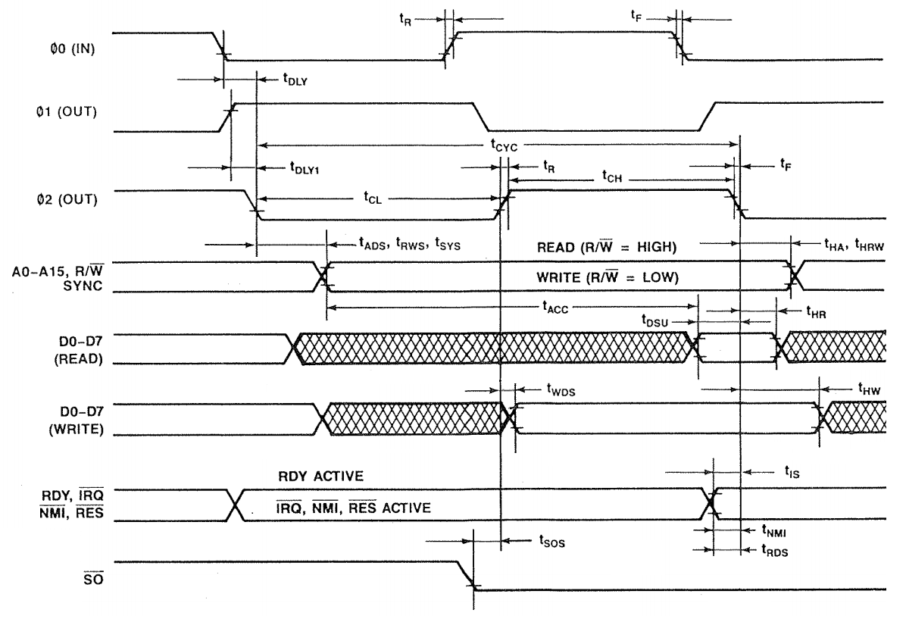
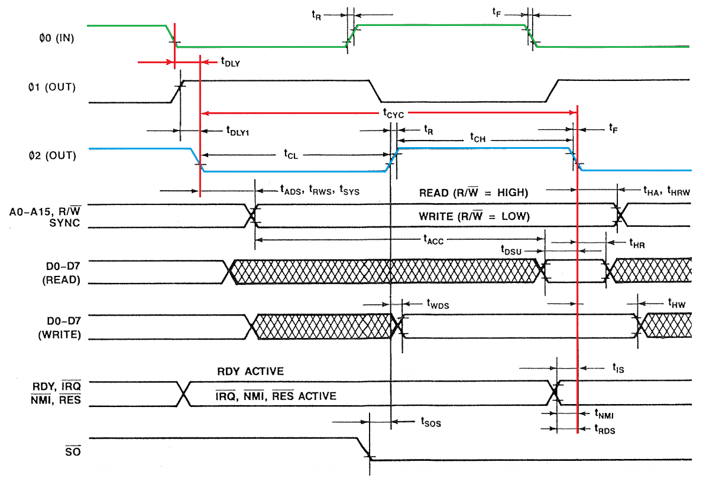
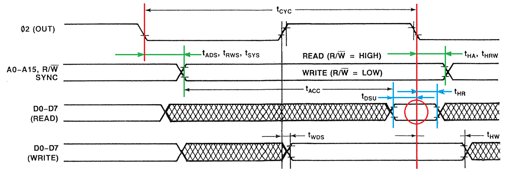
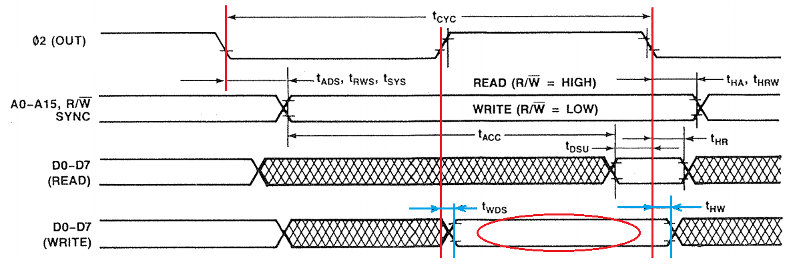

# RAM
Trying to build a 6502 based computer. 

One could argue that the [previous](../3eeprom/README.md) chapter resulted in a real computer: 
oscillator, CPU, EEPROM with a running program. The problem is that the only (RAM) memory the 
program used was the (A, X and Y) registers.

In this chapter we will add RAM.
But it is time to understand ... time.
Timing of the 6502 and memories.

## Timing
The datasheet of the 6502 has timing diagrams. The figure below was taken from the R65C02 datasheet.
I did remove some non-6502 aspects, and I use 1MHz version as context.

Those diagrams are packed with information. Take your time to study them. Some observations:
- On the left hand side we see signal names, like "ϕ0 (IN)".
- To the right of the signal name we see a curve describing that signal's behavior.
- Some signals are grouped, like RDY, nIRQ, nMNI, nRES because their curves behave identical.
- Some signals are split, for example D0-D7 _read_ behavior is split from D0-D7 _write_ behavior.
- There a vertical lines to delimit time intervals.
- Horizontal arrows between vertical lines couple a name to the interval, like tDLY.
- The interval names are detailed in the datasheet: tDLY is known as "ϕ0 Low to ϕ2 Low Skew" and is 50ns max.
- 50ns is a modest interval, compared to the "Cycle Time" tCYC of 1000ns (or 1us, recall, we run at 1MHz), but still 5%.
- Note also that (rising and falling) edges have horizontal tick lines that mark the moment the signal is considered high or low.

The 6502 is fed with a clock, this signal is the "ϕ0 (IN)" at the top of the diagram. 
In the diagram below I made the ϕ0 curve green.

- The green ϕ0 signal is an input for the 6502 (we can not see that from the timing diagram).
- The 6502 derives two output signals from it: ϕ1 and ϕ2. 
- The ϕ2 is the basis for other timings, it is an important signal, I made it blue (i did not color ϕ1)
- Note that the ϕ2 signal is nearly identical to ϕ0; the only difference is a shift of tDLY, which is max 50 ns.
- Note that the ϕ1 signal is the _inverse_ of ϕ0; and it is also a bit delayed with respect to ϕ0.
- See the importance of ϕ2: the time of ϕ1 is specified with ϕ2 as basis (tDLY1), and not ϕ0 as basis.
- The datasheet specifies tDLY1 as "ϕ0 Low to ϕ1 High Skew" and ranges from -20ns to +20ns.
- Be alert to that: tDLY2 could be _negative_, which means its (rising) edge is actually _after_ the (falling) edge of ϕ2.
- I made two vertical lines red: they are the anchors for other events during a clock pulse.
- Finally note the timing aspects of that one pulse: tCL (ϕ2 Low Pulse Width) of minimally 430ns, tCH (ϕ2 High Pulse Width) 
  of minimally 450ns, and even the "Clock Rise and Fall Times" (tR and tF) of maximally 25ns.
  
In the diagram below I have removed most of the clock clutter and other signals, so that we can focus on the timing behavior 
of memory access. Let's first have a look at the _read_ process.

- The key observation is that the 6502 clocks in the data when ϕ2 goes low. This is the red circle in the diagram.
  In other words, irrespective of the cycle time: **data read is on falling edge of ϕ2**. 
- Of course the data signal must be stable around that moment. That is the "diamond" enclosed in blue interval lines.
- "Read Data **Setup** Time" (tDSU) specifies that the data must be available at least 100ns before the falling edge.
- "Read Data **HOLD** Time" (tHR) specifies that the data must be stable until at least 10ns after the falling edge.
- The memory chip must supply that data (by raising/lowering) the data lines, but can only do that after the address 
  of the read location is know.
- The 6502 guarantees that the _address_ lines are available after ϕ2 goes low 
  with a delay of at most tADS "Address Delay Time" (125ns, green, left).
- The 6502 guarantees that the _address_ lines are stable until after ϕ2 goes low again 
  with a delay of at least tHA "Address Hold Time" (15ns, green, right).
- On top of that, the memory chip must also know that the action is a read action. The 6502 must set the R/nW line to 0 (read). 
- The 6502 guarantees that the _R/nW_ line is available after ϕ2 goes low 
  with a delay of at most tRWS "R/nW Delay Time" (125ns, green, left).
- The 6502 guarantees that the _R/nW_ line is stable until after ϕ2 goes low again 
  with a delay of at least tHRW "R/nW Hold Time" (15ns, green, right).
- Note that the "hatched" section in row "D0-D7 (READ)" shows the interval in which the data lines vary (hence the hatching). 
  The memory chip is raising/lowering the data lines given the states of the address lines and R/nW. 
  The memory chip has the complete clock cycle (1000ns) for that minus tADS (125ns) and tDUS (100ns).
- When the cycle time grows (lower clock frequency), the time for the memory chips grows since the tADS and TDUS stay equal.

The diagram below focusses on the timing behavior of the _write_ process.

