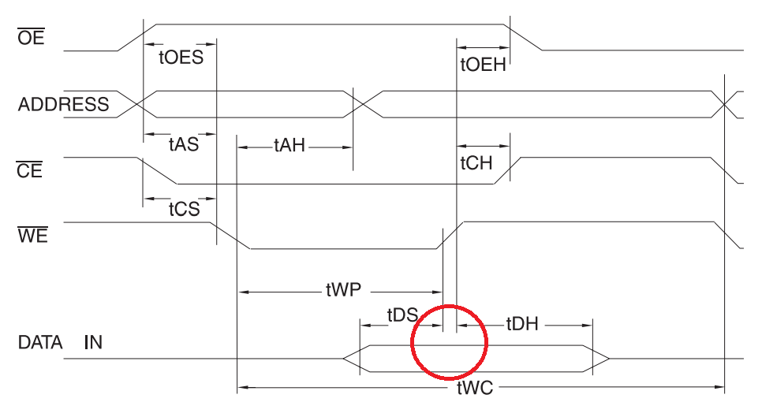
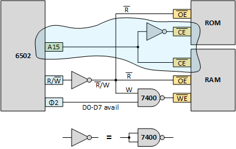

# 4. RAM
Trying to build a 6502 based computer. 

One could argue that the [previous](../3eeprom/README.md) chapter resulted in a real computer: 
oscillator, CPU, EEPROM with a running program. The problem is that the only (RAM) memory the 
program used was the (A, X and Y) registers.

In this chapter we will add RAM.
But it is time to understand ... time.
Timing of the 6502 and memories.

Adding a second peripheral (RAM next to the ROM) requires an address decoder to select which of the (two) chips should be selected.

The steps in this chapter
 - [4.1. Timing](README.md#41-Timing) - Study timing
 - [4.2. Adding RAM](README.md#42-Adding-RAM) - Adding RAM to our system with a simple address decoder
 - [4.3. Address decoder](README.md#43-Address-decoder) - Adding a future proof address decoder
 
## 4.1. Timing
The datasheet of the 6502 has timing diagrams. In this section we'll examine them.

### 4.1.1. Timing diagrams

The figure below was taken from the [R65C02 datasheet](http://archive.6502.org/datasheets/rockwell_r65c00_microprocessors.pdf) .
I did remove some non-6502 aspects, and I use 1MHz version as context.

Those diagrams are packed with information. Take your time to study them. Some observations:
- On the left hand side we see signal names, like "ϕ0 (IN)".
- To the right of the signal name we see a curve describing that signal's behavior.
- Some signals are grouped, like RDY, nIRQ, nMNI, nRES because their curves behave identical.
- Some signals are split, for example D0-D7 _read_ behavior is split from D0-D7 _write_ behavior.
- There are vertical lines to delimit time intervals.
- Horizontal arrows between vertical lines couple a name to the interval, like tDLY.
- The interval names are detailed in the datasheet: tDLY is known as "ϕ0 Low to ϕ2 Low Skew" and is 50ns max.
- 50ns is a modest interval, compared to the "Cycle Time" tCYC of 1000ns (or 1us, recall, we run at 1MHz), but still 5%.
- Note also that (rising and falling) edges have horizontal tick lines that mark the moment the signal is considered high or low.

### 4.1.2. 6502 Clocks

The 6502 is fed with a clock, this signal is the "ϕ0 (IN)" at the top of the diagram. 
In the diagram below I made the ϕ0 curve green.

- The green ϕ0 signal is an input for the 6502 (we can not see that from the timing diagram).
- The 6502 only uses ϕ0 to generate ϕ1 and ϕ2. The 6502 itself uses ϕ1 and ϕ2 for timing purposes, not ϕ0. 
  ϕ1 and ϕ2 are made available to external devices so that they can synchronize with the 6502.
  Also ϕ1 and ϕ2 are can drive higher loads than what the oscillator (which drives ϕ0) may drive.
- Especially ϕ2 is the basis for timing external chips. I made it blue (I did not color ϕ1)
- Note that the ϕ2 signal is nearly identical to ϕ0; the only difference is a shift of tDLY, which is max 50 ns.
- Note that the ϕ1 signal is the _inverse_ of ϕ0; and it is also a bit delayed with respect to ϕ0.
- See the importance of ϕ2: the time of ϕ1 is specified with ϕ2 as basis (tDLY1), and not ϕ0 as basis.
- The datasheet specifies tDLY1 as "ϕ0 Low to ϕ1 High Skew" and ranges from -20ns to +20ns.
- Be alert to that: tDLY2 could be _negative_, which means its (rising) edge is actually _after_ the (falling) edge of ϕ2.
- I made two vertical lines red: they are the anchors for other events during a 6502 clock pulse.
- Finally note the timing aspects of that one pulse: tCL (ϕ2 Low Pulse Width) of minimally 430ns, tCH (ϕ2 High Pulse Width) 
  of minimally 450ns, and even the "Clock Rise and Fall Times" (tR and tF) of maximally 25ns.

### 4.1.3. 6502 Read

In the diagram below I have removed most of the clock clutter and other signals, so that we can focus on the timing behavior 
of memory access. Let's first have a look at the _read_ process.

- The key observation is that the 6502 clocks in the data when ϕ2 goes low. This is the red circle in the diagram.
  In other words, irrespective of the cycle time: **data read is on falling edge of ϕ2**. 
- Of course the data lines must be stable around that moment. That is the "diamond" enclosed in blue interval lines.
- "Read Data **Setup** Time" (tDSU) specifies that the data must be available at least 100ns before the falling edge.
- "Read Data **Hold** Time" (tHR) specifies that the data must be stable until at least 10ns after the falling edge.
- The memory chip must supply that data (by raising/lowering) the data lines, but can only do that after the address 
  of the read location is know.
- The 6502 guarantees that the _address_ lines are available after ϕ2 goes low 
  with a delay of at most tADS "Address Delay Time" (125ns, green, left).
- The 6502 guarantees that the _address_ lines are stable until after ϕ2 goes low again 
  with a delay of at least tHA "Address Hold Time" (15ns, green, right).
- On top of that, the memory chip must also know that the action is a read action. The 6502 must set the R/nW line to 1 (read). 
- The 6502 guarantees that the _R/nW_ line is available after ϕ2 goes low 
  with a delay of at most tRWS "R/nW Delay Time" (125ns, green, left).
- The 6502 guarantees that the _R/nW_ line is stable until after ϕ2 goes low again 
  with a delay of at least tHRW "R/nW Hold Time" (15ns, green, right).
- Note that the "hatched" section in row "D0-D7 (READ)" shows the interval in which the data lines vary (hence the hatching). 
  The memory chip is raising/lowering the data lines given the states of the address lines and R/nW. 
  The memory chip has the complete clock cycle (1000ns) for that minus tADS (125ns) and tDUS (100ns).
- When the cycle time grows (lower clock frequency), the time for the memory chips grows since the tADS and tDUS stay equal.
  When the cycle time shrinks (higher clock frequency), the time for the memory chip shrinks as well. When the cycle 
  time approaches tADS+tDUS the system will no longer work.

> **My conclusion for a read cycle.** The 6502 will put address on A0-A15, and 1 on R/nW.
> If the memory chip is enabled (address decoding), and output is enabled (from R/nW), the memory chip will put data on D0-D7.
> The data lines must remain stable till tHR after the falling edge of ϕ2 so that the 6502 can clock them in.

> Only gate _output enable_ of the memory chip with R/nW, and _not_ with ϕ2 (because then we miss tHR).

This last conclusion contradicts [Grant's 6502 computer](http://searle.hostei.com/grant/6502/Simple6502.html)
and that scares me. He's much better than me at this.

### 4.1.4. 6502 Write

The diagram below focusses on the timing behavior of the _write_ process.

- The key observation: when ϕ2 is low the 6502 is setting up A0-A15, R/nW _and_ D0-D7.
- At least "Write Data Delay Time" (tWDS, 200ns) after the rising edge of ϕ2, D0-D7 is available.
- The 6502 will keep D0-D7 stable until at least "Write Data Hold Time" (tHW, 30ns) after the falling edge of ϕ2.

> **My conclusion for a write cycle.** The 6502 will put address on A0-A15, 0 on R/nW and data on D0-D7.
> The memory chip should be enabled (address decoding), and write should be enabled (from R/nW) until ϕ2 falls.
> Not longer, because soon after that the address lines will change.

> Gate _write enable_ of the memory chip with R/nW, _and_ with ϕ2.

### 4.1.5. Memory read

We should also have a look at the other side, the memory, for example the 
[AT28C16 datasheet](http://ww1.microchip.com/downloads/en/DeviceDoc/doc0540.pdf).
This is the timing diagram of read.

- The memory needs tACC of maximum 150ns after the address lines become valid to produce output on the datalines.
- The memory needs tCE of maximum 150ns after the "chip enable" becomes valid to produce output on the datalines.
- The memory needs tOE of maximum 700ns after the "output enable" becomes valid to produce output on the datalines.
- With the proposed wiring, all those signals become available (tADS ns) after the start of ϕ2 low, until ϕ2 goes low again.
- However, tOH "Output Hold" is specified to be 0ns. And this starts "from nOE, nCE or Address, whichever occurred first".
  So, if we would gate OE of the memory chip with ϕ2 going low, the memory chip would stop outputting data, 
  while the 6502 would stil nee dit for tHR

### 4.1.6. Memory write
This is the timing diagram of the write process of the memory asd found in the 
[AT28C16 datasheet](http://ww1.microchip.com/downloads/en/DeviceDoc/doc0540.pdf).

- The core observation is that the memory chip uses the rising edge of nWE to clock in data.
- The falling edge of ϕ2 is an ideal candidate.

### 4.1.7. Wiring
The conclusions for the read and write scenarios leads to following schematic.
Do note that most memory chips have the control signals low active: _ouput enable_ and _write enable_ and yes, even _chip enable_.

## 4.2. Adding RAM

We are going to complete our computer: add a second memory next to the ROM, a RAM.
So that finally we can use the zero page (00xx), have stack (01xx), or, well, store program data.

### 4.2.1. Address decoding

In the previous chapter we had a single 2kB EEPROM. It has a data range of 000-800 (hex).
We only connected 11 address lines of the 6502: A0-A10. The other 5 (A11-A15) were left dangling. 
This means that we have 32 mirrors of that 2kB. Whichever byte is at, say, 7FC also surfaces 800 higher (FFC), 
another 800 higher (17FC), another 800 higher (1FFC) and so on, up till FFFC.

We wrote simple programs at low addresses, and stored the reset address at 7FC, knowing it would mirror at FFFC.
But now we have two memories. If we connect both, in parallel, both would mirror on all locations causing "short circuits".
We need to enable one for some addresses, and enable the other for other adresses. Memory chips have a _chip enable_
pin just for this purpose.

Later we might add other chips (memory mapped IO) and allocating address space all the chips get more elaborated.
But for now, we can keep it simple. Since RAM needs to be at 0000 (for zero page, stack), and ROM needs to be at FFFC 
(for reset vector), we use A15 as chip selector. The below schematic implements what is sometimes referred to as
_address decoding_.

The schematic also repeats the connections of the other two control signals, nOE and nWE.
It also gives the hint that an invertor can be implemented with a NAND gate.
So two inverters and one NAND gate can be implemented with a single
[quad two-input NAND gate 74HCT00](https://assets.nexperia.com/documents/data-sheet/74HC_HCT00.pdf).

### 4.2.2. Memory map

With the above address decode, we get a so-called memory map. A memory map tells for all peripheral chips 
(ROM, RAM, and later GPIO, timer, UART, ...) which addresses they use. Ours is simple; we only have ROM and RAM.

As a RAM chip I have choosen a HM62256B. This is 256k bit SRAM organized in 32k words of 8 bits. 
This is chip engineer lingo for a chip of 32k byte RAM. That fits well with it being mapped from 0000 to 7FFF.

As a ROM chip we continue with the AT28C16; a 16k bit EEPROM organized in 2k words of 8 bits.
A 2k byte ROM. This chip is selected when A15 is 1, so it will be mirrored 16 times (A11, A12, A13 and A14 are dangling).
The above drawing ignores the mirrors and only shows the top "mirror".

### 4.2.3. Schematic

Find below the latest greatest schematic, to some extend our first complete computer: 
an oscillator driving the clock of a 6502, an EEPROM with code, a RAM for data,
and a simple address decode (blue).

which looks like this on my breadboard

### 4.2.4. New firmware

To test our latest computer, we need firmware. We will recycle our blinky program.
We cannot reuse because we need to adapt it to the new memory map.
We make another adaptation: we add an ISR

Our new [sketch](blinky-top.eeprom) consists of four parts
 - MAIN at F800, it initializes our program: enabling IRQ.
 - SUB1 loops around on F810-F81F, that is addresses 1111 1000 00**01** xxxx
 - SUB2 loops around on F820-F82F, that is addresses 1111 1000 00**10** xxxx
 - SUB3 loops around on F830-F83F, that is addresses 1111 1000 00**11** xxxx
 - As before, SUB1, when finished jumps to SUB2 and SUB2 when finished jumps to SUB1
 - SUB3 is vectored from IRQ and finishes with an RTI
 
Note the address patterns. I have connected LEDs to A4 andA5. When SUB1 is running LED4 is on and LED5 is off.
When SUB2 is running LED4 is off and LED5 is on. When the ISR is running both are on. 

The ISQ pushes the return address, and RTI pops it, this proves that RAM is working.

Here is the [video](https://youtu.be/GpOUKbiih6M) to proof it
 

## 4.3. Address decoder

We may think we have a full fledged computer -- cpu, clock, rom, ram -- but the truth is that we do not yet have 
any peripherals. Think GPIO ports, a UART, and maybe even things like a small keyboard or display. For that we need
to add memory mapped IO, and for that we need an address decoder. 

An address decoder looks at the address lines and decides which chip to enable: ROM, RAM, GPIO, UART etc.
In the previous section we already had an address decoder, but since it only had to choose between two chips, 
it was simple: A15 low selects RAM, A15 high selects ROM.

The following address decoder is prepared for the "future".
It has a place for an 32k RAM, an 8k ROM and 6 peripherals, like 
GPIOs (implemented by e.g. a VIA chip - Versatile Interface Adapter) or 
UARTS (implemented by e.g. a ACIA Asynchronous Communication Interface).

The [74138](https://www.onsemi.com/pub/Collateral/MC74AC138-D.PDF) decodes 3 ("binary") address lines into 1-of-8.
To my surprise, the outputs of the 74138 are low active, which happens to map perfectly to the nCE of most peripherals.

We use A15 to select (when 0) the RAM, or (when 1) the _decoder_.
The decoder splits the next 3 address lines (A14-A12) to 8 lines, each representing a 4k block in the memory map.
So each decoder output line corresponds with the highest nible of the address.

I plan to use an 8k ROM (not the 2k we have been using until now), so I needed to AND the upper two lines of the demux.
I used one NAND and one NAND as inverter. Those two were "left over" from the [two](README.md#417-Wiring) 
that create the OE and WE for the memory chips.

