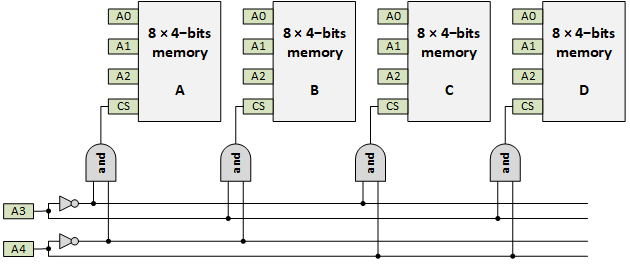

# 5. Memory decoder
Trying to build a 6502 based computer. 

We may think we have a full fledged computer -- cpu, clock, rom, ram -- but the truth is that we do not yet have 
any peripherals. Think GPIO ports, a UART, and maybe even things like a small keyboard or display. For that we need
to add memory mapped IO, and for that we need an address decoder. 

The steps in this chapter
 - [5.1. Theory](README.md#51-Theory) - We see what an address decoder is
 - [5.2. Implementation](README.md#52-Implementation) - We implement our future proof decoder
 - [5.3. Test](README.md#53-Testing) - We add some "fake" peripherals to test our decoder
 

## 5.1. Theory

An address decoder is a piece of logic that uses the state of all address lines to activate a "location".
Typically this is a "memory location", but it could also be a "special function register" in a memory mapped device.

## 5.1.1. A single device

Let us start simple and examine a (simplified) memory.

We see here a memory chip with 3 address lines (A0, A1, A2). This means the chip can have (and indeed it has) 8 locations
(the grey columns consisting of four boxes). Each location in this (simplified) memory chip stores 4 bits 
(a box represents a single bit store). Memory designers call this an 8×4bit memory.

The important part to note here has a blue box labeled "address decoding". We see that every address line splits in two, 
one being high when the address lines is 0 and one being high when the address line is 1. Each location has an AND port 
that selects the a unique address pattern from 000 to 111. The locations are labeled with these patterns.

Note the design of address lines, inverters and multi input AND gates. That implements address decoding.

Also note that the complete address decoding is internal in the chip. No external address decoding is needed when 
you have a single peripheral to the CPU. This is why in our [EEPROM only](../3eeprom/README.md#33-6502-with-eeprom-and-oscillator)
computer there was no address decoder.

## 5.1.2. A second device

Let us assume that we want to have a bigger memory in our computer. If you were a chip designed you might consider 
designing a bigger chip. Let's give it an extra address line and double the number of memory locations.

When we look at the above memory chip, we see that it is a simple extension of the previous one.
The chip designer just added an A3 line, added the low and high select lines, and added a fourth input on each AND.
This extends the 8×4bit memory into an 16×4bit memory (16 locations of each 4 bit). Address decoding is completely 
inside the 16×4bit memory chip.

But, if we are not a designer, we could also just buy _two_ 8×4bit memory chips. That gives us the same amount of memory.
The trick is that every chip has one extra control line that was not yet drawn in the 8×4bit memory of the previous section: 
the chip select or CS line. Please be aware that in this theoretical story I use "positive" logic, many chips have 
low-active CS lines.

We see that the CS line is an input for every AND gate. Basically, when CS is low, the whole chip is disabled.
And that is precisely the point. When A3=0, the left chip is active, when A3=1, the right chip is active.

Note that a large part of the address decode is inside the two chips, but a small part is outside: the green part,
and more specifically a single NOT gate.

This is precisely the situation in [EEPROM only](../4ram/README.md#421-simple-address-decoding): we had two chips,
and EEPROM and a RAM, and we used A15 with an inverter to select between the two.

## 5.1.3. Four peripherals

You might wonder if the "chip select line" approach scales. What happens if we have multiple memories or peripherals?
Yes, the the CS architecture works, but the external address decoding logic increases.

Above we see the AND-gate pattern that was _inside_ the chip, now also emerge _outside_ the chip.

This is the situation in the [next section](README.md#52-Implementation).

## 5.1.4. Memory map

The address decoding logic relates one-to-one to a _memory map_.

The four chip memory decoder from the previous sections leads to this memory map.

Device A runs from 0b00000-0b00111, or 0x00-0x07.

Device B runs from 0b01000-0b01111, or 0x08-0x0F.

Device C runs from 0b10000-0b10111, or 0x10-0x17.

Device D runs from 0b11000-0b11111, or 0x18-0x1F.

## 5.2. Implementation

After all the theory, let's build an address decode for our 6502 computer.

In the previous chapter we already had an address decoder, but since it only had to choose between two chips, 
it was simple: A15 low selects RAM, A15 high selects ROM. Let's build one that not only decode for a
ROM and a RAM, but also for a couple of peripherals.

### 5.2.1. Introduction

Does the below picture look familiar?

It should. It is drawn in a different style, but it is actually the inverter, AND gate and chip select we
have seen in the above theory on address decoding.

I did not draw that picture. It is the logic diagram representing the 74ACT138 as
given in its [datasheet](https://www.onsemi.com/pub/Collateral/MC74AC138-D.PDF).

This is a so-called 1-of-8 decoder (or 3-to-8 decoder). One chip does all.

What is even more surprising is that the _outputs_ of the 74138 are low-active, and that happens
to match my chips: they all have a low active chip select. No extra chips needed.

### 5.2.2. Description

The following address decoder is prepared for the "future".
It has a place for an 32k RAM, an 8k ROM and 6 peripherals, like 
GPIOs (implemented by e.g. a VIA chip - Versatile Interface Adapter) or 
UARTS (implemented by e.g. a ACIA Asynchronous Communication Interface).

We use A15 to select (when 0) the RAM, or (when 1) the _decoder_.
The decoder splits the next 3 address lines (A14-A12) to 8 lines, each representing a 4k block in the memory map.
So each decoder output line corresponds with the highest nible of the address.

I plan to use an 8k ROM (not the 2k we have been using until now), so I needed to AND the upper two lines of the demux.
I used one NAND and one NAND as inverter. Those two were "left over" from the [two](README.md#4-2-1-Simple-address-decoding) 
that create the OE and WE for the memory chips.

### 5.2.3. Address decode schematic

The schematic of our 6502/ROM/RAM with future proof decoder is as follows.

Find below a photo of my breadboard, with labels added.

### 5.2.4. Conclusion

We are running the same [sketch](../4ram/blinky-top.eeprom) as in the previous chapter.
And we get the same [result](https://youtu.be/LvaN9udekvI).

We have now room to add one or two VIAs for LEDs, 7-segment display, switches, or maybe even a scanning keyboard.
Or we could add a serial port. That is for the next chapters.

## 5.3. Testing

