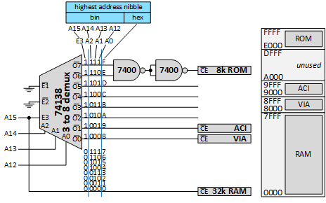

# 5. GPIO
Trying to build a 6502 based computer. 

We are going to add a peripheral to our computer.
The first peripheral we add is the VIA, or 
[Versatile Interface Adapter](http://archive.6502.org/datasheets/mos_6522_preliminary_nov_1977.pdf).
his is a chip that implements two 8-bit GPIO ports, has timers and interrupts.

Since we do not know the VIA, we start small

## 5.1. No RAM
How does the VIA work? The VIA has 16 registers, here we list the first four.

 | address (RS3-RS0) | register |      description                             |
 |:-----------------:|:--------:|:--------------------------------------------:|
 |     0000          |   ORB    | Output Register port B (0=low, 1=high)       |
 |     0001          |   ORA    | Output Register port A (0=low, 1=high)       |
 |     0010          |  DDRB    | Data Direction Register port B (0=in, 1=out) |
 |     0011          |  DDRA    | Data Direction Register port A (0=in, 1=out) |

So, let's connect a LED to pin PB0, which corresponds to bit 0 of port B.
This means that that we have to write a 00 to DDRB to make (all pins) output.
Next, we have to write 00 and FF to ORB to have the LED blink.

```
LDA #$FF # All pins output
STA *$02 # DDRB

LDA #$00 # All pins low
STA *$00 # ORB

LDA #$FF # All pins high
STA *$00 # ORB
```

Of course, we would need a wait loop between the low and high, but this
seem very doable.

However, we need hardware. We need to hook a VIA to our computer.
The problem is that the address decode we currently have can only handle
two peripherals (EEPROM and RAM).

To keep it simple, I decide to replace the RAM and add the VIA instead.
This means code is still F800-FFFF. But instead of RAM at 0000-7FFF, we now
have the VIA 0000-000F.

So the above assembler, which uses zero-page address 02 for `DDRB` 
and 00 for `ORB` matches with this memory map.

The [script](via-blinky-b0.eeprom) to program EEPROM is like the one
shown above, but then with wait (nested) loops. It was assembled
[online](https://www.masswerk.at/6502/assembler.html).


## 5.2. Address decode

The following address decoder is prepared for the "future".
It has a place for an 32k RAM, an 8k ROM and 6 peripherals, like VIAs.

The [74138](https://www.onsemi.com/pub/Collateral/MC74AC138-D.PDF) decodes 3 ("binary") address lines into 1-of-8.
To my surprise, the outputs of the 74138 are low active, which happens to map perfectly to the nCE of most peripherals.



We use A15 to select (when 0) the RAM, or (when 1) the decoder.
The decoder splits A12-A14 to 8 lines, each representing a 4k block in the memory map.
So each line corresponds with the highest nible of the address.

I plan to use an 8k ROM (not the 2k we have been using until now), so I needed to AND the upper two lines of the demux.
I used one NAND and one NAND as inverter.


