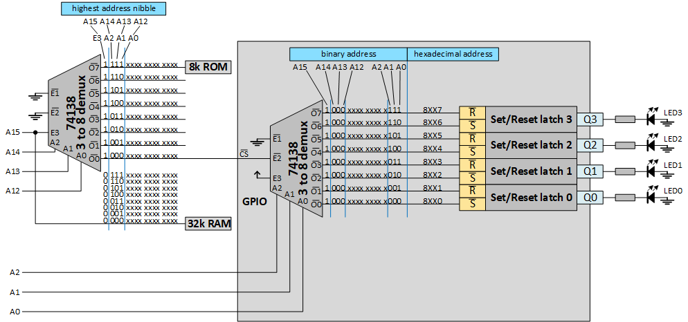
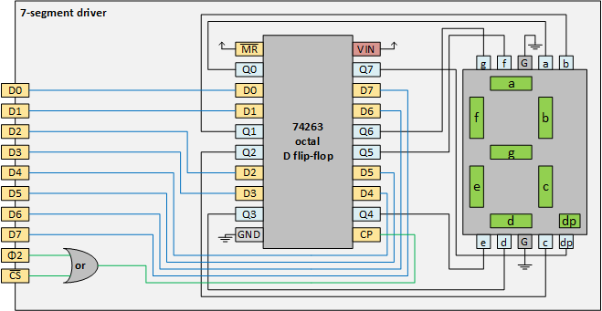
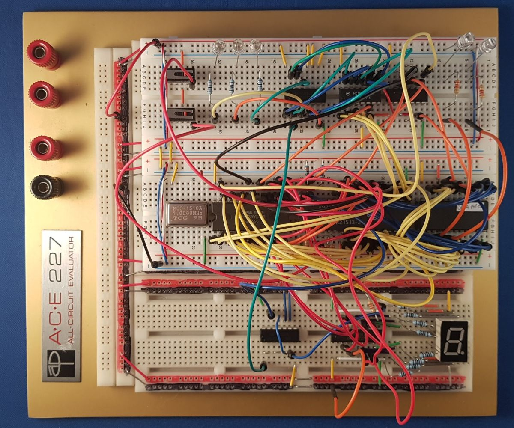
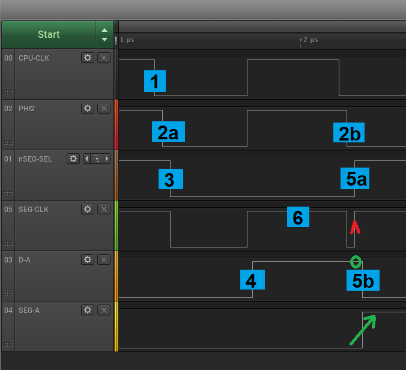
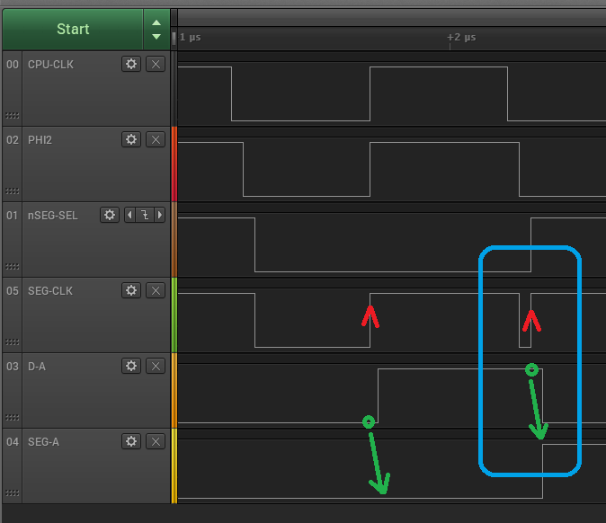
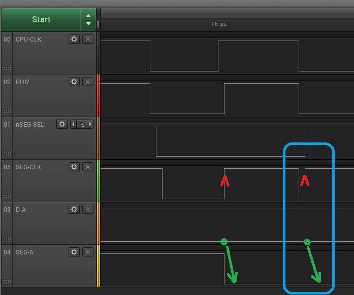
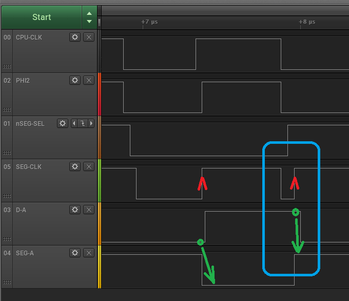
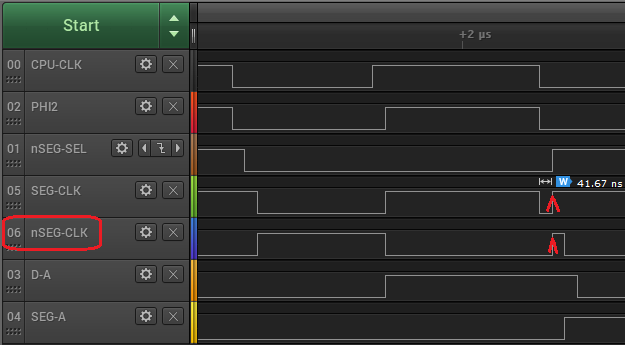
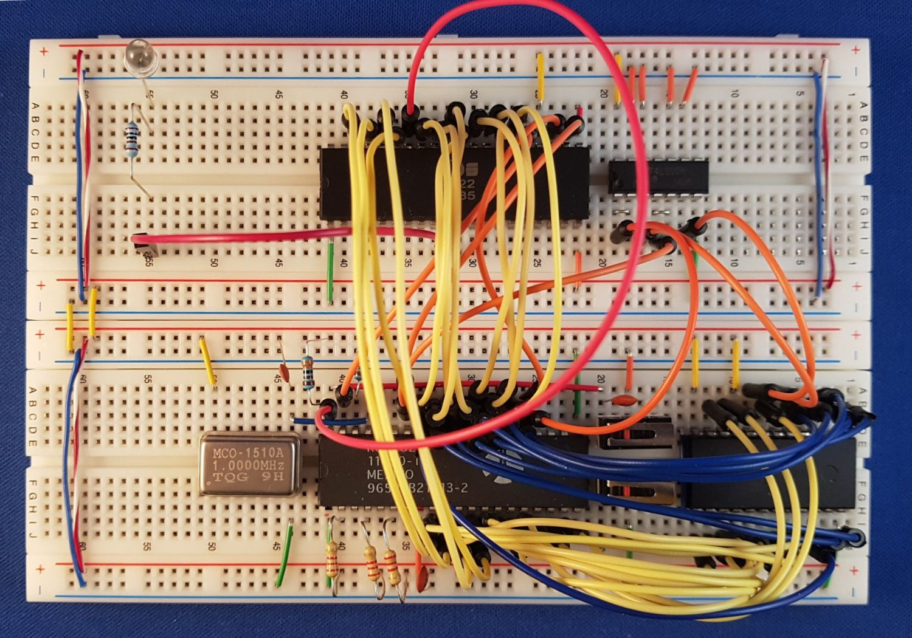

# 6. GPIO
Trying to build a 6502 based computer. 

We are going to add peripherals to our computer.
In this chapter we look at various options for General Purpose Input and Output (GPIO) ports.

 - [6.1. Address pins](README.md#61-Address-pins) - Looking back: LED on address pin
 - [6.2. Address decoding](README.md#62-Address-decoding) - Looking back: using the memory decoder
 - [6.3. 7-segment display](README.md#63-7-segment-display) - Do-it-yourself GPIO peripheral: 7-segment display
 - [6.4. VIA](README.md#64-VIA) - The official GPIO from MOS


## 6.1. Address pins

One of the first things we did to get feedback from the 6502 is to hook up LEDs to address lines.
We used two approaches.

### 6.1.1. Monitor pins

The first approach was just to monitor the address changes. 
We used this during the [free run](../1clock#12-clock---oscillator).
The CPU runs NOP after NOP; it starts at EAEA and runs to FFFF, wraps to 0000 and so on. 
During one loop the CPU executes 64k NOPs, each at 2 cycles, so this takes 131 072 cycles or 0.13s.
This means that the blink frequency of A15 is 8Hz, quite fast.

This first approach is ok for a free run, but as soon as we start writing real programs, the loops
are typically much smaller, so monitoring an address line no longer works.

### 6.1.2. Address range

Enter the second approach. We had a clever idea of having wait loops on specific address ranges.
As long as the wait loop executes in that range, some address pins have a fixed value.
As long as the wait loop executes in another range, that address pins has the opposite value.
We can use that for creating a blink with configurable.

This is what we did when our computer consisted only of a [6502 and EEPROM](../3eeprom#34-blinky).
Even after adding a [RAM](../4ram#42-adding-ram) we used this approach because we had no other peripherals.

But even the second appraoch is not very generic: JMPs, RAM accesses and ISRs tend to break the LED patterns.


## 6.2. Address decoding

To have control over LEDs, we need a "GPOI peripheral". In the 6502 world, peripherals are memory mapped.
This means we need an address decoder to activate the different peripherals.

The idea is that the decoder has an activation line ("Chip Select") for the peripheral.
The activation line is active for some memory range. 
The peripheral implements a set of registers in that range, so that the 6502 can write (or read) those registers,
and the peripherals takes action. This is how, for example, the [VIA](README.md#64-VIA) works.

In the section that [tested the decoder](../5decoder#53-testing) we had 6 activation lines for 6 address ranges 
(8xxx, 9xxx, Axxx, Bxxx, Cxxx, and Dxxx). And we simply used two activation lines per LED, one for switching it on
and one for switching it of; this was implemented with a Set/Reset latch.

Fully flexible; down-side is that we only have 3 LEDs. 
Of course, this could be extended by having another 3-to-8 decoder in e.g. the 8xxx range.
And then adding 8 Set/Reset latches. The diagram below shows a concept:



This (sub) decoder decodes lines A0-A2. So, to switch LED3 on access memory 8006 and to switch it off access 8007
(but 8016 and 8017 or 8FF6 and 8FF7 work as well).


## 6.3. 7-segment display

One of my goals is to turn this 6502 computer into a hex programmable one.
This means that it needs a display for the address (4 x 7-segment) and for the data (2 x 7-segment).
Most boards that are around trade hardware for software: the boards save on hardware and compensate that with more software 
(that, in this case, scans the segments).

For me this project is about learning _hardware_, so my goal is to make a 7-segment peripheral that relies largely on hardware.

### 6.3.1. Concept

The idea that I had was as follows: the activation signal from the address decoder, the chip select, could trigger a clock
pulse of eight D-type flop-flops. If we connect the inputs of the flip-flops to the 8 address lines, 
then the output of the flip-flops can drive LEDs. 

The cost here is one [octal D flip-flop](https://www.ti.com/lit/ds/symlink/sn54ls273-sp.pdf) IC per 7-segment display. 
So we would need 6. And we need a secondary address decoder to select one of the 6.

I made a first prototype of a single 7-segment driver. This is the schematic:



### 6.3.2. Board

I hooked the 8 data lines to the data lines of the 6502.
I hooked the nCS to the 8xxx line of the address decoder.
And I hooked ϕ2 to ϕ2 of the 6502.

> I must say that I'm still a bit puzzled by the OR construction: it generates a falling edge on CP when ϕ2 falls, and the segment driver is selected (nCS is low). However the datasheet of the 74273 says the latching happens on rising edge of CP. So why is the inverter not needed?

> Found an error (OR should maybe be NOR), read on...

On the photo, see the 6502 computer (crystal, EEPROM, RAM, segment decoder and even still 
the 3 S/R latches with LEDS, and the 2 addres line LEDS), connected to the 7-segment driver.
I made the OR with three NAND gates.



### 6.3.3. Firmware

To put e.g. a `2` on the display, segments a, b, g, e, and d need to be on. 
The bits are mapped as follows to the segments `dp|g|f|e|d|c|b|a`.
Therefore the bit pattern for `2` is `01011011`. 
Likewise, the bit patterns for `6`, `5`, `0`, `2` and `-` were constructed.

The complete [script](7-segment.eeprom) adds a wait routine and loops back.

```asm
LDA #%01111101
STA $8000
JSR WAIT

LDA #%01101101
STA $8000
JSR WAIT

LDA #%00111111
STA $8000
JSR WAIT

LDA #%01011011
STA $8000
JSR WAIT

LDA #%01000000
STA $8000
JSR WAIT
```


### 6.3.4. Test

Power to the board, reset, and [enjoy](https://youtu.be/t_L_AEqfp-k).


### 6.3.5. Timing analysis

Timing wise, the circuit is not completely sound. 

#### 6.3.5.1 Details

Let's have a look at the details, which I captured with my logic analyser, a [Saleae](https://www.saleae.com).



- The first row `00 CPU-CLK` show the 6502 clock signal. At (1) a cycle starts; the diagram shows only one cycle.
- The second row `02 PHI2` shows the ϕ2 as output by the 6502. Note that it is indeed a bit delayed with respect to the clock. 
  Especially the falling edges (2a) and (2b) are delayed, for the rising edge we do not see a delay
  (but this is probably due to the accuracy of my Saleae).
- The third row `01 nSEG-SEL` is the 8xxx output of the address decoder. Note that it goes low as soon as A12-A15 form 8.
  We see that (3) is a bit later then (2a), which makes sense. Not only does our address decoder need some time,
  also the 6502 itself outputs A0-A15 some time (tADS, see [timing diagram](.../4ram/README.md#413-6502-read))
  after ϕ2 goes low. (3) is an important moment: the address decoder notices that the 7-sgement will be written.
- Again, completely following the [spec](../4ram/README.md#414-6502-write), the data line for segment 'a' (D0)
  on row 5 `03 D-A` becomes valid (4) just after ϕ2 goes high. Also (4) is important, this is the data that 
  needs to go to the 7-segment display.
- Row 4 `05 SEG-CLK` shows the clock signal fed to the D flip-flops; we made this signal as an OR from
  `PHI2` and `nSEG-SEL`. The red up arrow shows the rising edge that causes the flip-flops to clock-in.
- At the moment the `SEG-CLK` goes high (red arrow), the data D0 (for segment 'a' `D-A` on row 5) is high (green circle), 
  which causes the flip-flop to "flip" its output to high (green arrow on row 6 `04 SEG-A` showing the line to segment 'a').
- Note, at the end of the clock, the address lines (5a) as well as the data lines (5b) change for the next instruction.
- Our OR causes a problem: the `SEG-CLK` signal gets an extra bump (6). So we have two rising edges per clock.
  How big is that problem?

#### 6.3.5.2. Timing OK

The trace below shows the `SEG-CLK` goes up twice. The first time the data is still old, but the second time (blue box)
the data is (as specified by the 6502 timing diagram) correct, and clocked in. 
This capture happens to show the behavior we want to see on the segment.



#### 6.3.5.3. Timing early

The trace below shows a case where the first rising edge (first red arrow) already clocks in the data.
The second rising edge clocks-in the correct data (blue box), in this case the data is the same.
This capture shows the segment updates earlier then expected, but that is ok.



#### 6.3.5.4. Timing correction

The trace below shows that the early clock-in, is not always the correct data.
The second clock-in does take the correct data, but there is a 0.4us flicker on the display.
This capture shows the circuit is sub-optimal, we have a flicker on the segment.



#### 6.3.5.5. Fixing an error

I suddenly realized that the OR is **wrong**.
When the `nSEG-SEL` is low (meaning the segment is selected by the address decoder) and the `PHI2` goes low, the `SEG-CLK` goes low,
because it is OR'ed. But it should go high, so we need a NOR. Why is the circuit working? I added the NOT after the OR, and 
captured timing with the logic analyser.



Please be aware that my logic analyser has a capture speed of 25MS/s or 40ns per sample. On row 4 we see a small dip of 41.67ns,
which is in the order of the capture resolution of my device.

Anyhow, row 5 `06 nSEG-CLK` is now the NOT signal of the `SEG-CLK` we used previously.
What we see is that the rising edge (given the accuracy of my logic analyzer) comes around the same moment - and the 
falling edges are ignored. That's why the both circuits (with and without NOT) work.

And, we are lucky. The [spec](../4ram/README.md#414-6502-write) guarentees that data (D-A) stays valued tHW after 
ϕ2 goes low. tHW is at least 30ns, so with our 41.67ns we are ... well ... lucky. Not production quality.

#### 6.3.5.6. Timing conclusion

All observed cases clock-in the correct data, but sometimes this is preceeded by an incorrect one.
This seems acceptable. However, I do not like the extra dip, so I think the circuit needs to be clocked.
  

## 6.4. VIA
The next peripheral we try is the VIA, or 
[Versatile Interface Adapter](http://archive.6502.org/datasheets/mos_6522_preliminary_nov_1977.pdf).
This is a chip that implements two 8-bit GPIO ports, has timers and interrupts.

Since we do not know the VIA, we start small.

### 6.4.1. No RAM
How does the VIA work? The VIA has 16 registers, here we list the first four.

 | address (RS3-RS0) | register |      description                             |
 |:-----------------:|:--------:|:--------------------------------------------:|
 |     0000          |   ORB    | Output Register port B (0=low, 1=high)       |
 |     0001          |   ORA    | Output Register port A (0=low, 1=high)       |
 |     0010          |  DDRB    | Data Direction Register port B (0=in, 1=out) |
 |     0011          |  DDRA    | Data Direction Register port A (0=in, 1=out) |
 |     ..            |          |                                              |
 |     1111          |          |                                              |

So, let's connect a LED to pin PB0, which corresponds to bit 0 of port B.
This means that that we have to write a FF to DDRB to make (all pins) output.
Next, we have to write 00 and FF to ORB to have the LED blink.

``` asm
LDA #$FF # All pins output
STA $02  # DDRB

LDA #$00 # All pins low
STA $00  # ORB

LDA #$FF # All pins high
STA $00  # ORB
```

The code above is a rough sketch. 
Firstly, we used the addresses local to the chip (02 and 00).
Secondly, we would need a wait loop between the low and high, but this seem very doable.

However, we need to hook a VIA to our computer.
The problem is that the address decode we currently have can only handle
two peripherals (EEPROM and RAM).

To keep it simple, I decide to replace the RAM and add the VIA instead.
This means EEPROM is still F800-FFFF. But instead of RAM at 0000-7FFF, we now
have the VIA 0000-000F.

So the above assembler, which uses address 02 for `DDRB` 
and 00 for `ORB` matches with this memory map.

The [script](via-blinky-b0.eeprom) to program EEPROM is like the one
shown above, but then with wait (nested) loops. It was assembled
[online](https://www.masswerk.at/6502/assembler.html).




