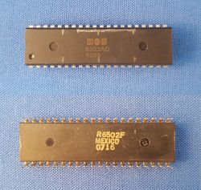
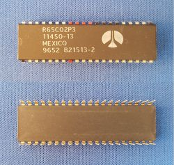
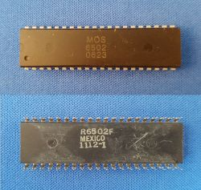

# 6502
Trying to build a 6502 based computer

## 0 Introduction
I took up the challenge of building my own computer. I grew up with the [Commodore 64](https://en.wikipedia.org/wiki/Commodore_64).
It has a [6502](https://en.wikipedia.org/wiki/MOS_Technology_6502) processor. This processor was also used by Apple, Atari, Nintendo. 
It is simple, still available, and many hobbyist before me [documented](http://6502.org/) their projects. So 6502 it was.

I started by ordering hardware. I already had breadboards, jumper wires, resistors, LEDs. The main (first) purchase was the 6502 itself.
The [first](https://www.aliexpress.com/item/32929325067.html) variant (left) I got was an original one from MOS from 1985. 
I had problems resetting it (on power up it runs, but after a reset if freezes - is it broken?). 
Then I [learned](http://wilsonminesco.com/NMOS-CMOSdif/) that the old ones are NMOS, and that there are new CMOS versions. 
I got my [second](https://www.aliexpress.com/item/32990938828.html) variant (middle), which works well. 
A [third](https://www.aliexpress.com/item/32841499879.html) variant (right) seems to be an old one again, 
although the logo and time stamp look different from the first. It does work, but it gets warmer than the variant 2.

  

[MOS6502 datasheet](https://www.mdawson.net/vic20chrome/cpu/mos_6500_mpu_preliminary_may_1976.pdf) says 
"Clock cycle time is minimal 1000ns" or 1us, or you operate the device out of spec. So the old NMOS is not very forgiving.

[R65C02 datasheet](https://www.usbid.com/assets/datasheets/15/rockwell.pdf) says 
"Caution must be exercised when configuring the R65C02 in the standby mode (i.e. PHI0 clock stopped). The input clock can be held in the high state indefinitely; however, if the input clock is held in the low state longer than 5 microseconds, internal register and data status can be lost." I tried it, and this CMOS version allowed me more 30 second low, but then still, it would loose state.

[W65C02 datasheet](https://www.mouser.com/datasheet/2/436/w65c02s-2572.pdf) says 
"Phase 2 In (PHI2) is the system clock input to the microprocessor internal clock. During the low power Standby
Mode, PHI2 can be held in either high or low state to preserve the contents of internal registers since the
microprocessor is a fully static design." So the modern CMOS version is most flexible. Did buy one yet.

## 1 Clock
We need a clock, a source of pulses. 

The [first chapter](1clock/README.md) discusses three options.
The hardest way is to build your own oscillator based on a crystal, but I would recommend the next option:
get that circuit as a whole in a "can".
Thirdly, since many have it available: you could also use an Arduino Nano as clock source.

## 2 Emulation
The Nano as clock source was not only easy, it also gave me an idea.
When the Nano controls the clock, it also knows when to sample the address lines. 
We then have a _spy_ that can follow each (clock) step.

That appeares to work very well, as discussed in the [second chapter](2emulation/README.md).
Would it even be possible to sample the data lines? Yes! and spoof the data lines? Yes!
The Nano now emulates a memory in addition to a clock.

## 3 EEPROM
The Nano was fun, but this is a hardware project, not a software project.
So, we keep the Nano to run the clock and use it to sample the address and data bus for tracing purposes.
But we add a real memory.
RAM would have advantages (can hold code and data), but I don't know how to fill the RAM with (initial) code.
So let's first add EEPROM. With that working, we replace the Nano with a real oscillator.

The [third chapter](3eeprom/README.md) explains how to hook up an EEPROM to the 6502. 
And as a side project we develop an EEPROM programmer so that the 6502 has some code to work on
(and the Nano has some code to spy on).

## 4 RAM
One could argue that the previous chapter resulted in a real computer: oscillator, CPU, EEPROM with a running program.
The problem is that the only (RAM) memory the program used was the (A, X and Y) registers.

In chapter [four](4ram/README.md) we add a RAM.

As a side project, we study timing.

## 5 Memory decoder
We may think we have a full fledged computer -- cpu, clock, rom, ram -- but the truth is that we do not yet have 
any peripherals. Think GPIO ports, a UART, and maybe even things like a small keyboard or display. For that we need
to add _memory mapped IO_, and for that we need an address decoder.  

When adding the RAM next to the ROM we already had a minimalistic address decoder.
In chapter [five](5decoder/README.md) we add a "future proof" one.

## 6 GPIO
We have a computer without peripherals. In this [chapter](6gpio/README.md) we investigate options
for "General Purpose Input and Output" or GPIO ports. We look back at solutions used in previous chapters,
and introduce new ones. One of the candidates is the VIA, or Versatile Interface Adapter that 
was produced by MOS, the manufacturer of the 6502.

The VIA is a chip that implements two GPIO ports (each with 8 lines), has timers and interrupts.

## 7 UART

Adding the ACIA...

## 8 Monitor

Adding a monitor program to write/read and go...

## Other

Keyboard, 7-segment display, interrupt timer, single step, slow clock.
