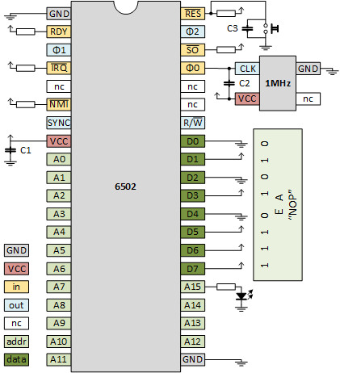
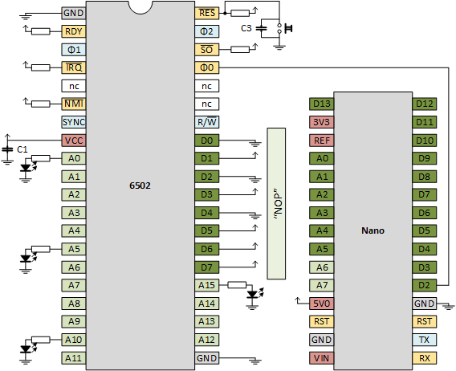

# 6502
Trying to build a 6502 based computer

## Introduction
I took up the challenge of building my own computer. I grew up with the [Commodore 64](https://en.wikipedia.org/wiki/Commodore_64).
It has a [6502](https://en.wikipedia.org/wiki/MOS_Technology_6502) processor. This processor was also used by Apple, Atari, Nintendo. 
It is simple, still available, and many hobbiest before me [documented](http://6502.org/) their projects. So 6502 it was.

## Hardware
I started by ordering hardware. I already had breadboards, jumper wires, resistors, LEDs. The main (first) purchase was the 6502 itself.
The [first](https://www.aliexpress.com/item/32929325067.html) variant (left) I got was an original one from MOS from 1985. 
I had problems resetting it (on power up it runs, but after a reset if freezes - is it broken?). 
Then I [learned](http://wilsonminesco.com/NMOS-CMOSdif/) that the old ones are NMOS, and that there are new CMOS versions. 
I got my [second](https://www.aliexpress.com/item/32990938828.html) variant (middle), which works well. 
A [third](https://www.aliexpress.com/item/32841499879.html) variant (right) seems to be an old one again, 
although the logo and time stamp look different from the first. It does work, but it gets warmer than the variant 2.

[](6502-1.png) [](6502-2.png) [](6502-3.png)

## Clock
We need a clock, a source of pulses. There are several options. Remember that a classical 6502 runs at 1MHz. 
It seems that not match variantion is allowed in the clock frequency for the old variants.
It seems that the new variants allow much more variation. 
Anyhow, I don't need speed (that only causes all kinds of electrical problems).
I prefer slow, as in hand clocked, to see in detail what is going on.

The hardest way is to [build](https://www.grappendorf.net/projects/6502-home-computer/clock-generation.html) your own oscillator 
based on a [crystal](https://www.aliexpress.com/item/32869213435.html). Tried. Works. Do not recommend.

Much easier is to get a ["can"](https://www.aliexpress.com/item/32887401548.html) that presumably contains the crystal
and the passives around it. The 1MHz versions are a bit hard to get. Works well. Do recommend.

The third way is more the software approach: use an Arduino Nano to generate the clock. This is especially nice at the start 
of your project. You might already have it laying around. You do not need to order any other special components, and it gives 
you a nice road to other experiments: let the Nano spy on the address bus, or even spoof the databus!

### Clock - crystal
I skip this approach for now.

### Clock - oscillator
Our first board will have a canned oscilator. 
How to wire the 6502? We need to
 - ensure that all input pins are connected
 - hook up the clock circuit
 - hook up a reset circuit
 - ensure we can check that the 6502 is running



#### Clock - oscillator - connect all inputs
[This](http://lateblt.tripod.com/bit63.txt) was one of my sources for how to hook up pins.

Of course we hook up GND (twice) and VCC.

All input pins (I made them yellow) need to be connected.
All signal pins (RDY, IRQ, NMI, RES, SO) are low-active, so I hooked them via a pullup to VCC. My pull-ups are 2k2Ω.
The φ0 is the clock-input, we hook it to the osccilator (see below).
The RES not only has a pull-up, it is also hooked to the reset circuit (see below).

A special category of input pins are de data pins.
I have wired them 1110 1010 or EA, which is the opcode for NOP.
This means that the 6502 will always read NOP and will thus free run (spin around).
See also [James Calvert](http://mysite.du.edu/~jcalvert/tech/6504.htm).

There is one subtlety: also the reset vector reads as EAEA.
But once the 6502 jumps to that address, it reads NOPs.

The NC pins and address pins are not connected.


#### Clock - oscillator - hook up a clock circuit
As a clock circuit, we have a canned oscillator, and [MCO-1510A](http://mklec.com/pdf/MCO-1510A.pdf).
Pin 1 is NC (not connected).
Pin 7 (yes, not 2) is grounded.
Pin 8 is the OUTPUT; the clock towards the 6502
Pin 14 is VCC.

Once VCC and GND are connected, you can put a scope on OUTPUT.


Vertically, we have 2.5 divisions of each 2V, so a swing of 5V.
Horizontally, we have two divisions per pulse so 1000ns or 1us or 1Mhz.
Looks good.

We also see overshoots at the rising edges.
Although we are running only at 1MHz, it is wise to dampen them.
That's why we added capacitor C2. You need a small one, like 680pF.


#### Clock - oscillator - hook up a reset circuit
We keep is simple. A push button pulls RES to ground.
Added a cap to suppress (bounce) spikes and have a slow release.

In case you are wondering C=100nF, R=2k2Ω, so rise time 𝜏 = R×C = 100n×2k2 = 220us.
Indeed, on the scope we see that in one division (200us) the signal is at 63% (1𝜏).


Some hook up an NE555 to reset-after-power-on, 
see e.g. [Grappendorf](https://www.grappendorf.net/projects/6502-home-computer/reset-circuit.html).

#### Clock - oscillator - running
The most easy way to see that the 6502 is running, is to monitor its address lines.
Note that NOP is a one byte instruction (size-wise), but that it takes 2 cycles (time-wise).


At some moment in time address, let's say, 0x8000 is read. 
Let's call this tick 0. The 6502 finds a NOP.
Executing NOP takes tick 0 and 1.
On clock tick 2 address 0x8001 is read, and the 6502 finds again a NOP.
Executing the second NOP takes tick 2 and 3.
And so on.

  |  tick  | address | instruction |  A0  |
  |:------:|:-------:|:-----------:|:----:|
  |    0   | 0x8000  |  NOP (1st)  |   0  |
  |    1   | 0x8000  |  NOP (1st)  |   0  |
  |    2   | 0x8001  |  NOP (2nd)  |   1  |
  |    3   | 0x8001  |  NOP (2nd)  |   1  |
  |    4   | 0x8002  |  NOP (3rd)  |   0  |
  |    5   | 0x8002  |  NOP (3rd)  |   0  |

What we see from the tabel above is that two full periods of the clock (tick 0 and 1), A0 is low.
And then the next two clock periods (tick 2 and 3) A0 is high.
So it takes 4 clock periods for one A0 period.

This is confirmed on the scope, the top shows A0, the botton the clock


Note that the clock runs at 1MHz.
The following table shows the frequencies and periods of each address lines.

  |  line  | freq (Hz) | period (us) | period (s) |
  |:-------|----------:|------------:|-----------:|
  | clock  | 1 000 000 |           1 |            |
  |        |   500 000 |           2 |            |
  | A0     |   250 000 |           4 |            |
  | A1     |   125 000 |           8 |            |
  | A2     |    62 500 |          16 |            |
  | A3     |    31 250 |          32 |            |
  | A4     |    15 625 |          64 |            |
  | A5     |     7 813 |         128 |            |
  | A6     |     3 906 |         256 |            |
  | A7     |     1 953 |         512 |            |
  | A8     |       977 |       1 024 |            |
  | A9     |       488 |       2 048 |            |
  | A10    |       244 |       4 096 |       0.00 |
  | A11    |       122 |       8 192 |       0.01 |
  | A12    |        61 |      16 384 |       0.02 |
  | A13    |        31 |      32 768 |       0.03 |
  | A14    |        15 |      65 536 |       0.07 |
  | A15    |         8 |     131 072 |       0.13 |

  
A15 is already fast at 8Hz, so we fixed a LED to the last address line.
LEDs on "lower" address lines flicker so fast the look "always on".

Note that A15 is flickering after power on. When we keep the reset button pressed, it stops flickering.
When releaseing the reset, the flickering start.
Success, we have a 6502 in free run!


### Clock - Nano
Our second board will have an Arduino Nano as clock generator.


#### Clock - Nano - wiring
It is not much different from the previous board, but it offers much more flexibility.
One nice feature is that you can power the 6502 from the Nano (connect 5V0 to VCC, and of course connect all GNDs).
We need the same "stubs": RDY, IRQ, NMI, RES, SO are pulled-up. Have a button to pull-down RES.
Wire D0-D7 to 1110 1010 representing NOP.
New is that φ0 is connected to D2 of the Nano.
Since the Nano will be slower than the oscillator it is good to have LEDs on lower address lines too.



#### Clock - Nano - software
Find the sketch for the Nano in directory [clock6502](clock6502).
We will see later that the Nano generates a clock of ~160kHz.

#### Clock - Nano - running


The scope confirms the slow clock: 7 divisions (35us) is 5 periods, so one period is 7us.
The clock frequency is thus 143kHz.

Note that the Nano itself runs on 16MHz. This means that the `loop()` takes 100 Nano clock cycles to 
generate one 6502 clock cycle. So, a single `digitalWrite()` takes roughly 50 cycles.

#### Clock - Nano - software II
Find the sketch for the Nano in directory [clockvar6502](clockvar6502).
This sketch allows you to enter + or - in the Serial port (the arduino terminal requires a press on the ENTER key as well).
This will shorten or lengthen the high part of the clock pulse.

In my first version, this program did
```
low, wait/2, high, wait/2
```
but I changed this to
```
low, no-wait, high, wait
```
because the 6502 stops working when the low time is too long.

With the current program the Nano can vary the clock from 100kHz to 0.06Hz.


